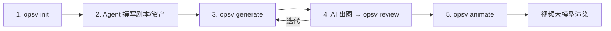

# OpsV 0.2 — 版本全景交接文档
> 纪元：`0.2.1` → `0.2.27` | 40 项核心迭代 | 2026 年 Q1

---

## 一、产品概述：OpsV 是什么？

OpenSpec-Video（OpsV）是一套 **"Spec as Guide"** 的 AI 视频制作协议。

它的核心信仰是：**用确定性的结构去承载非确定性的艺术**。

导演用 Markdown 写剧本、定义角色和场景，OpsV 的 CLI 编译器把这些 `.md` 文件翻译成标准化的 JSON 任务队列，再由浏览器扩展喂给 Gemini / ComfyUI / Veo 等多模态 AI 引擎执行渲染。agent 负责创作故事，脚本，提示词，人类只负责**审核文档和选图**，机器负责**编译文档和出图**。

### 核心工作流（五步闭环）



| 阶段     | 人类职责                     | 机器职责                               |
| -------- | ---------------------------- | -------------------------------------- |
| **创意** | 描述灵感、选择方案           | `/opsv-architect` 生成故事大纲         |
| **资产** | 审阅角色/场景设定            | `/opsv-asset-designer` 生成 YAML+描述  |
| **分镜** | 审阅静态分镜草图             | `/opsv-shot-designer` 生成 YAML 分镜表 |
| **定稿** | 在 Markdown 中删除不满意的图 | `opsv review` 自动注入草图链接         |
| **动态** | 审阅动态提示词               | `/opsv-animator` 生成 `Shotlist.md`    |

---

## 二、技术架构全景

### 2.1 目录结构

```
MyProject/
├── .agent/skills/          # 10 个 AI Agent 技能（随 opsv init 脚手架）
│   ├── opsv-architect/     # 项目总建筑师（两阶段：发散→锚定）
│   ├── opsv-story-writer/  # 编剧（story.md）
│   ├── opsv-asset-designer/# 美术总监（角色/场景/道具 .md）
│   ├── opsv-shot-designer/ # 分镜师（Script.md YAML 分镜表）
│   ├── opsv-animator/      # 动画导演（Shotlist.md 动态台本）
│   ├── opsv-director/      # 监制（QA 质检自动化）
│   └── ...
├── videospec/              # 唯一真相源
│   ├── project.md          # 全局配置（画幅/风格后缀/vision）
│   ├── stories/story.md    # 故事大纲
│   ├── elements/           # 角色、道具（每个一个 .md）
│   ├── scenes/             # 场景（每个一个 .md）
│   └── shots/
│       ├── Script.md       # 静态分镜剧本（美术构图）
│       └── Shotlist.md     # 动态摄影台本（运镜指令）
├── artifacts/
│   ├── drafts/             # 初始草图
│   ├── drafts_1/ ~ drafts_N/ # 批次草图（增量命名，不覆盖）
│   └── videos/             # 视频输出
├── queue/
│   ├── jobs.json           # 静态图像生成队列
│   └── video_jobs.json     # 动态视频生成队列
└── GEMINI.md               # AI Agent 人格与约束规则
```

### 2.2 核心 TypeScript 模块

| 模块                 | 路径                                 | 职责                                                                                                               |
| -------------------- | ------------------------------------ | ------------------------------------------------------------------------------------------------------------------ |
| **AssetCompiler**    | `src/core/AssetCompiler.ts`          | 扫描 `videospec/` 下所有 `@资产`，建立内存索引，解析 `project.md` 全局配置，组装 `[imageN]` 占位符                 |
| **AssetManager**     | `src/core/AssetManager.ts`           | 加载角色/场景的 Zod Schema 校验，提取 `reference_images` 和 `has_image` 状态                                       |
| **JobGenerator**     | `src/automation/JobGenerator.ts`     | 编译 `elements/` `scenes/` `shots/` 为 `queue/jobs.json`，三段提示词架构（中文叙事 + 英文渲染 + 结构化 payload）   |
| **AnimateGenerator** | `src/automation/AnimateGenerator.ts` | 编译 `Shotlist.md` 为 `queue/video_jobs.json`，严格校验首帧底图存在性                                              |
| **Reviewer**         | `src/automation/Reviewer.ts`         | 扫描 `artifacts/drafts_N/`，将草图链接注入对应 `.md` 文档（资产插在 `## 参考图` 下方，分镜插在对应 Shot 描述下方） |
| **Daemon**           | `src/server/daemon.ts`               | WebSocket 全局守护进程（端口 3061），接收浏览器扩展的 `SAVE_ASSET` 事件，增量命名防覆盖                            |
| **PromptSchema**     | `src/types/PromptSchema.ts`          | Zod 类型定义：`Job { id, type, prompt_en, payload, reference_images, output_path }`                                |

### 2.3 三段提示词架构（The Trisected Prompt）

这是 0.2 版本最核心的设计决策。一个 Job 同时携带三种语言通道：

```
┌─────────────────────────────────────────────────┐
│ prompt_en (根级字段)                              │
│ 纯英文 CLIP 渲染指令，给 SD/Flux/ComfyUI         │
│ 拼接 global_style_postfix                        │
├─────────────────────────────────────────────────┤
│ payload.prompt (嵌套字段)                         │
│ 中文叙事上下文，给 Gemini/Veo 等多模态大模型       │
│ 包含 [imageN] 占位符 + 任务 ID 标签               │
├─────────────────────────────────────────────────┤
│ payload.subject / environment / camera            │
│ 结构化元数据，给前端 UI 或 ComfyUI 节点解析        │
└─────────────────────────────────────────────────┘
```

### 2.4 动静管线分离

| 维度         | 静态图像管线             | 动态视频管线                |
| ------------ | ------------------------ | --------------------------- |
| **数据源**   | `Script.md` (YAML shots) | `Shotlist.md` (YAML shots)  |
| **编译器**   | `JobGenerator`           | `AnimateGenerator`          |
| **CLI 命令** | `opsv generate`          | `opsv animate`              |
| **输出**     | `queue/jobs.json`        | `queue/video_jobs.json`     |
| **Job type** | `image_generation`       | `video_generation`          |
| **参考图**   | `@实体` 特征图           | 确认过的镜头底图 + 运镜指令 |

---

## 三、CLI 用户手册

### 3.1 安装

```bash
npm install -g videospec
```

### 3.2 命令一览

| 命令                           | 说明                                                               |
| ------------------------------ | ------------------------------------------------------------------ |
| `opsv init <name>`             | 创建新项目脚手架（含 `.agent/skills/`、`videospec/`、`GEMINI.md`） |
| `opsv generate [targets...]`   | 编译 Markdown 为 `queue/jobs.json`（静态图像）                     |
| `opsv generate --preview`      | 仅生成关键镜头预览                                                 |
| `opsv generate --shots 1,5,12` | 仅生成指定镜头                                                     |
| `opsv review`                  | 扫描所有资产/分镜，将最新草图链接注入 `.md`                        |
| `opsv review --alldrafts`      | 注入所有历史批次的草图链接                                         |
| `opsv review <target.md>`      | 仅对单一文档执行注入                                               |
| `opsv animate`                 | 编译 `Shotlist.md` 为 `queue/video_jobs.json`（动态视频）          |
| `opsv serve`                   | 手动启动全局 WebSocket 守护进程（通常自动启动）                    |

### 3.3 多 AI 工具支持 (Multi-Tool Support)

OpsV 0.2.28+ 支持多种 AI 助手，您可以在 `opsv init` 时进行选择：

#### 1. Gemini (Legacy)
- **配置文件**: `GEMINI.md`
- **特点**: 最早支持的工具，规则与人格直接定义在根目录。

#### 2. OpenCode
- **配置文件**: `AGENTS.md` + `.opencode/`
- **特点**: 深度集成，自动识别 `.opencode` 目录下的指令。

#### 3. Trae
- **配置文件**: `AGENTS.md` + `.trae/rules/`
- **使用说明**: 
    - 由于 Trae 的机制限制，`opsv init` 虽会生成配置文件，但仍需用户**手动创建智能体**。
    - **操作步骤**: 请复制项目根目录下 `AGENTS.md` 的全部内容，在 Trae 的智能体创建界面中作为“自定指令”或“人格设定”粘贴进去。
    - **规则生效**: 创建后，Trae 会自动索引 `.trae/rules/` 下的 `opsv_core.md` 和 `opsv_workflow.md`。

### 3.4 Agent 技能速查

| 技能                   | 触发方式           | 输入                 | 输出                             |
| ---------------------- | ------------------ | -------------------- | -------------------------------- |
| `/opsv-architect`      | 对话调用           | 一句灵感             | `project.md` + `story.md`        |
| `/opsv-story-writer`   | 对话调用           | 故事设定             | `stories/story.md`               |
| `/opsv-asset-designer` | 对话调用           | 角色/场景需求        | `elements/*.md` 或 `scenes/*.md` |
| `/opsv-shot-designer`  | 对话调用           | 故事大纲             | `shots/Script.md`（YAML 分镜表） |
| `/opsv-animator`       | 对话调用           | 确认过的 `Script.md` | `shots/Shotlist.md`（动态台本）  |
| `/opsv-director`       | 对话调用 `opsv-qa` | 整个项目             | 红绿灯质检报告                   |

### 3.5 典型工作流

```
1. opsv init HappyAsImmortal
2. 对 Agent 说："帮我基于这首歌词创建一个仙侠风 MV"
   → /opsv-architect 生成 project.md + story.md
3. /opsv-asset-designer 逐个创建角色和场景
4. opsv generate              # 第一轮出图
5. opsv review                # 将草图注入文档
6. 人类在 Markdown 中删除不满意的图，保留最好的
7. opsv generate              # 第二轮迭代（基于确认图）
8. /opsv-animator             # 生成动态台本
9. opsv animate               # 编译视频队列
```

---

## 四、0.2.x 核心演进回顾

### 第一纪元：基础设施（0.2.1 ~ 0.2.7）
- 建立了 `@` 资产引用体系和 `AssetCompiler`
- 创建了 4-Agent 分工体系（编剧/美术/分镜/监制）
- 解决了鸡生蛋问题（`opsv init` vs Agent Skills）
- 统一了 `GEMINI.md` 人格模板

### 第二纪元：技能重构（0.2.8 ~ 0.2.12）
- 将原始的 `opsv-new` 拆分为 4 个专精 Agent
- 引入 `<thinking>` 强制深度推理步骤
- 建立 `references/` 范例目录体系
- 修复 Zod Schema 与 0.2 结构的兼容性

### 第三纪元：提示词工程（0.2.13 ~ 0.2.24）
- 发明了**三段提示词架构**（中文叙事 / 英文渲染 / 结构化元数据）
- 引入 `global_style_postfix` 全局风格后缀
- 引入 `[imageN]` 占位符和 `reference_images` 数组
- 引入任务 ID 标签（`[角色/场景设定: @id]`）
- 将 YAML-First 格式推广到 Shots 分镜表

### 第四纪元：文档驱动（0.2.25 ~ 0.2.27）
- 创建 `opsv review` 命令，实现**文档即审批**
- 建立增量批次目录 `drafts_N`，防止草图覆盖
- 守护进程增量命名（`_1`, `_2`），同一队列可反复执行
- **动静管线分离**：`Script.md`（静态美术）与 `Shotlist.md`（动态运镜）彻底解耦
- 创建 `opsv animate` 命令和 `AnimateGenerator`

---

## 五、核心设计理念

### 1. 文档即真相 (Doc as Source of Truth)
Markdown 文件是唯一的权威。不论 Agent 说了什么、生成了什么，最终只有写进 `.md` 并经用户确认的内容才会被编译器采纳。这消灭了幻觉的传播链。

### 2. 确定性的骨架，非确定性的血肉
YAML Frontmatter 是骨架（机器严格解析），Markdown Body 是血肉（人类阅读理解）。两者共存于同一个文件，但各司其职，互不侵犯。

### 3. 资产先行 (Asset-First)
在写分镜之前，必须先有独立的实体资产。`@实体` 只是一个指针，它的视觉定义永远住在 `elements/实体名称.md` 里。分镜里严禁刻画外貌——这是防特征污染的铁律。如果需要更改外貌，必须先更改/增加`elements/实体名称.md`里的内容。

### 4. 好品味原则 (Good Taste)
消除特殊情况而非增加 `if/else`。整个 0.2 的演进史就是不断消灭分支的过程。

### 5. 动静分离 (Decoupled Pipelines)
静态分镜描述画面构图，动态台本描述运镜动作。两者由不同的编译器处理，产出不同的 JSON 队列，喂给不同的 AI 引擎。

---

## 六、0.3.x 版本展望

> [!IMPORTANT]
> 以下是基于 0.2 经验的建议方向，供 0.3 开发参考。

### 6.1 视频队列执行器
0.2 只负责**编译**（Markdown → JSON），不负责**执行**（JSON → 渲染）。0.3 应当实现一个内置的 `VideoExecutor`，直接对接可灵/Veo/Sora 的 API，形成完整的端到端闭环。

### 6.2 多模态 Review
当前 `opsv review` 只处理图片。0.3 应扩展为支持视频片段的 Review——将生成的 `.mp4` 也注入回 `Shotlist.md`，供导演在 Markdown 预览中直接播放审阅。

### 6.3 时间轴编排
当前的 `Shotlist.md` 缺少时间轴信息。0.3 应引入 `start_time` / `duration` 字段，使编译器能够生成带有精确时间码的视频剪辑队列，并最终导出为 EDL / XML 供专业剪辑软件导入。

### 6.4 角色一致性引擎
0.2 依赖参考图来维持角色一致性，但这是被动的。0.3 应探索主动的一致性方案：为每个场景/元素建立更多是视角/状态的参考图，,使得生成视觉更具有稳定性。

### 6.5 协作与版本控制
当前项目是单人工作流。0.3 应考虑多人协作场景：Git-based 的资产版本控制、冲突合并策略、以及基于 PR 的审批流程。

### 6.6 实现ComfyUI 的本地API接入
0.3 应引入本地ComfyUI API，通过定制工作流与模型配合，实现低成本的批量图像与视频生成。


---

> *代码会腐烂，但正确解决问题的思维模式应该永存。*
> *——OpsV 0.2，写给未来的自己*

### 支持作者

如果你喜欢这个项目，欢迎打赏支持
Buy me a coffe if you like the project（only for wechat）：

