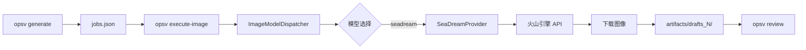

# OpenSpec-Video 0.3.3 版本计划

> **版本代号**: ImageStream  
> **目标**: 原生图像生成 API 集成  
> **核心功能**: SeaDream 5.0 Lite 接入

---

## 版本概述

0.3.3 版本是 OpsV 从"任务编译器"向"端到端生成平台"演进的关键一步。在此前版本中，图像生成依赖浏览器扩展手动拖拽；0.3.3 引入原生 API 调用能力，实现真正的自动化图像生成流水线。

---

## 核心变更

### 1. 新增图像执行架构

```
src/executor/
├── providers/
│   ├── ImageProvider.ts          # 图像提供商接口 (新增)
│   ├── VideoProvider.ts          # 现有
│   ├── SeaDreamProvider.ts       # SeaDream 实现 (新增)
│   └── SiliconFlowProvider.ts    # 现有
├── VideoModelDispatcher.ts       # 现有
└── ImageModelDispatcher.ts       # 图像调度器 (新增)
```

### 2. CLI 新增命令

```bash
# 执行图像生成任务队列
opsv execute-image

# 选项
opsv execute-image \
  --model seadream-5.0-lite \    # 指定模型
  --concurrency 1 \               # 并发数（保守默认1）
  --skip-failed \                 # 失败继续
  --dry-run                       # 仅验证不执行
```

### 3. 扩展类型系统

```typescript
// PromptSchema.ts 新增
interface ImageConfig {
    seed?: number;              // 随机种子
    steps?: number;             // 推理步数 1-50
    cfg_scale?: number;         // 提示词遵循度 1-20
    negative_prompt?: string;   // 负面提示词
    sampler?: 'Euler' | 'Euler a' | 'DPM++ 2M';
    hires_fix?: boolean;        // 高清修复
}
```

---

## SeaDream 5.0 Lite 集成

### API 端点

```
POST https://ark.cn-beijing.volces.com/api/v3/images/generations
```

### 认证方式

```bash
# 环境变量
export SEADREAM_API_KEY=your_api_key
# 或
export VOLCENGINE_API_KEY=your_master_key
```

### 支持功能

| 功能 | 支持 | 说明 |
|------|------|------|
| 文生图 | ✅ | txt2img |
| 图生图 | ✅ | img2img，strength 0.7 |
| 负面提示词 | ✅ | negative_prompt |
| 种子控制 | ✅ | seed 参数 |
| 画幅比例 | ✅ | 1:1, 16:9, 9:16, 4:3, 21:9 |
| 分辨率 | ✅ | 480p-4K 自适应 |
| 高清修复 | ⚠️ | Pro 版本支持 |

### 生成参数映射

| OpsV 参数 | SeaDream 参数 | 默认值 |
|-----------|---------------|--------|
| aspect_ratio | width/height | 1024x1024 |
| quality | 尺寸倍率 | 1.5x (2K) |
| prompt_en | prompt | 必填 |
| image_config.negative_prompt | negative_prompt | 通用负面词 |
| image_config.steps | steps | 30 |
| image_config.cfg_scale | cfg_scale | 7.5 |
| seed | seed | -1 (随机) |

---

## 工作流程

### 完整图像生成流程



### 命令执行示例

```bash
# 1. 编译任务
opsv generate
# ✓ Generated 12 jobs

# 2. 验证任务（可选）
opsv execute-image --dry-run
# ✓ Valid: 12, Invalid: 0

# 3. 执行生成
opsv execute-image --model seadream-5.0-lite
# ▶ Starting pipeline...
#    Progress: 12/12 (100%)
# ✅ Completed! Success: 12, Failed: 0
#    Duration: 45.2s

# 4. 审阅结果
opsv review
```

---

## 配置说明

### api_config.yaml

```yaml
models:
  seadream-5.0-lite:
    provider: seadream
    type: image
    features:
      - txt2img
      - img2img
      - negative_prompt
      - seed_control
      - aspect_ratio
    max_size:
      width: 2048
      height: 2048
    defaults:
      steps: 30
      cfg_scale: 7.5
```

### .env

```bash
# 必需
SEADREAM_API_KEY=your_seadream_api_key

# 可选（日志）
LOG_LEVEL=info
OPSV_DEBUG=false
```

---

## 与现有工作流整合

### 混合模式（API + 浏览器扩展）

```bash
# 对于复杂角色，使用浏览器扩展精细调整
opsv generate
# 在 Gemini 中手动优化关键角色

# 对于场景批量生成，使用 API
opsv execute-image --model seadream-5.0-lite --concurrency 2

# 审阅后更新参考图
opsv review
```

### 优先级策略

| 场景 | 推荐方式 | 原因 |
|------|----------|------|
| 主角角色设计 | 浏览器扩展 | 需反复迭代 |
| 场景背景 | API 批量 | 量大且相对标准 |
| 道具资产 | API 批量 | 一致性好 |
| 特殊效果 | 浏览器扩展 | 需要精确控制 |

---

## 性能与限制

### 生成速度

| 分辨率 | 预估时间 | 成本参考 |
|--------|----------|----------|
| 1024x1024 | 2-3s | ~0.05元/张 |
| 1536x1536 | 4-6s | ~0.10元/张 |
| 2048x2048 | 8-12s | ~0.20元/张 |

### 并发限制

- 默认并发: 1（保守，避免限流）
- 任务间隔: 1秒
- 建议最大并发: 2-3

### 重试策略

- 网络错误: 指数退避，最多3次
- API 限流: 自动等待后重试
- 无效参数: 立即失败

---

## 测试覆盖

### 单元测试

```
tests/unit/executor/
├── SeaDreamProvider.test.ts      # SeaDream 提供商测试
│   ├── 基础配置验证
│   ├── API 调用测试
│   ├── 画幅比例解析
│   ├── 分辨率倍率
│   ├── 重试机制
│   └── 图生图功能
└── ImageModelDispatcher.test.ts  # 调度器测试（计划中）
```

### 集成测试

```bash
# 完整流水线测试
opsv init test-project
cd test-project
# 创建测试资产
opsv generate
opsv execute-image --model seadream-5.0-lite
# 验证输出
```

---

## 向后兼容性

### 与 0.3.2 的兼容性

- ✅ `jobs.json` 格式完全兼容
- ✅ 浏览器扩展继续可用
- ✅ `opsv generate/review` 无变化
- ⚠️ 新增 `image_config` 字段（可选）

### 升级路径

```bash
# 1. 更新代码
git pull origin main
npm install

# 2. 配置 API Key
echo "SEADREAM_API_KEY=xxx" >> .env

# 3. 更新 api_config.yaml
cp templates/assets/api_config.yaml assets/

# 4. 验证
opsv execute-image --dry-run
```

---

## 未来扩展

### 0.3.4 计划

- [ ] Stability AI 集成
- [ ] Midjourney API（官方支持后）
- [ ] 本地 ComfyUI 支持
- [ ] 批量图像增强（放大/修复）
- [ ] 智能种子推荐

### 长期规划

- [ ] 多模型投票生成（生成多张选最优）
- [ ] 自动提示词优化
- [ ] 风格迁移一致性
- [ ] 图像到 3D 资产

---

## 参考文档

- [SeaDream 5.0 Lite API 文档](https://www.volcengine.com/docs/82379/1824121)
- [OpsV ImageProvider 接口](./src/executor/providers/ImageProvider.ts)
- [配置示例](./templates/assets/api_config.yaml)

---

**版本**: 0.3.3 (ImageStream)  
**状态**: 开发中  
**预计发布**: 2026-Q2
