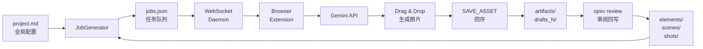

# OpenSpec-Video (OpsV) 技术分析文档

> **版本**: 0.3.2  
> **分析日期**: 2026-03-15  
> **项目定位**: "Spec as Guide" 的 AI 视频制作协议与自动化框架

---

## 目录

1. [项目概述](#1-项目概述)
2. [架构全景图](#2-架构全景图)
3. [核心技术栈](#3-核心技术栈)
4. [核心模块详解](#4-核心模块详解)
5. [数据流与编译管线](#5-数据流与编译管线)
6. [代码质量分析](#6-代码质量分析)
7. [安全性评估](#7-安全性评估)
8. [扩展性分析](#8-扩展性分析)
9. [技术债务与改进建议](#9-技术债务与改进建议)
10. [竞品对比](#10-竞品对比)

---

## 1. 项目概述

### 1.1 核心理念

OpenSpec-Video（简称 OpsV）是一套 **"Spec as Guide"** 的 AI 视频制作协议。其核心信仰是：

> **用确定性的结构去承载非确定性的艺术。**

导演使用 Markdown 撰写剧本、定义角色和场景，OpsV 的 CLI 编译器将 `.md` 文件翻译成标准化的 JSON 任务队列，再通过浏览器扩展或 API 直接调用 Gemini、ComfyUI、Veo 等多模态 AI 引擎执行渲染。

### 1.2 关键设计原则

| 原则 | 说明 |
|------|------|
| **文档即真相 (Doc as Source of Truth)** | Markdown 是唯一的权威来源，消灭 AI 幻觉的传播链 |
| **资产先行 (Asset-First)** | 在写分镜前必须先有独立实体资产，`@实体` 是指针而非描述 |
| **动静分离 (Decoupled Pipelines)** | 静态分镜(`Script.md`)与动态台本(`Shotlist.md`)完全解耦 |
| **二元极简主义** | `has_image` 布尔值决定编译策略：true=简略描述+参考图，false=详细描述 |

---

## 2. 架构全景图

### 2.1 系统架构分层

```
┌─────────────────────────────────────────────────────────────────────────┐
│                          用户交互层 (User Layer)                         │
│  ┌─────────────┐  ┌─────────────┐  ┌─────────────┐  ┌─────────────────┐ │
│  │  CLI 命令行  │  │ AI Agent对话 │  │ 浏览器扩展   │  │ 视频编辑器(未来) │ │
│  └──────┬──────┘  └──────┬──────┘  └──────┬──────┘  └─────────────────┘ │
└─────────┼────────────────┼────────────────┼─────────────────────────────┘
          │                │                │
          ▼                ▼                ▼
┌─────────────────────────────────────────────────────────────────────────┐
│                          编译层 (Compiler Layer)                         │
│  ┌─────────────────┐  ┌─────────────────┐  ┌─────────────────────────┐  │
│  │  SpecParser     │  │  AssetCompiler  │  │  JobGenerator           │  │
│  │  (配置解析)      │  │  (资产索引)      │  │  (静态任务队列生成)       │  │
│  └─────────────────┘  └─────────────────┘  └─────────────────────────┘  │
│  ┌─────────────────┐  ┌─────────────────┐  ┌─────────────────────────┐  │
│  │  AnimateGenerator│  │  Reviewer       │  │  ShotManager            │  │
│  │  (视频队列生成)   │  │  (审阅回写)      │  │  (分镜状态管理)          │  │
│  └─────────────────┘  └─────────────────┘  └─────────────────────────┘  │
└─────────────────────────────────────────────────────────────────────────┘
                                    │
                                    ▼
┌─────────────────────────────────────────────────────────────────────────┐
│                          执行层 (Execution Layer)                        │
│  ┌─────────────────────────┐  ┌─────────────────────────────────────┐  │
│  │  WebSocket Daemon       │  │  VideoModelDispatcher               │  │
│  │  (本地服务 ws://:3061)   │  │  (多模型调度器 + 依赖图谱解析)        │  │
│  └─────────────────────────┘  └─────────────────────────────────────┘  │
│  ┌─────────────────────────┐  ┌─────────────────────────────────────┐  │
│  │  SiliconFlowProvider    │  │  FrameExtractor (FFmpeg)            │  │
│  │  (硅基流动 API 实现)      │  │  (视频尾帧提取)                      │  │
│  └─────────────────────────┘  └─────────────────────────────────────┘  │
└─────────────────────────────────────────────────────────────────────────┘
                                    │
                                    ▼
┌─────────────────────────────────────────────────────────────────────────┐
│                          外部服务层 (External Services)                  │
│  ┌─────────────┐  ┌─────────────┐  ┌─────────────┐  ┌─────────────────┐ │
│  │  Gemini API │  │ SiliconFlow │  │  ComfyUI    │  │  Veo / Sora     │ │
│  │  (生图/对话) │  │  (生视频)    │  │  (本地渲染)  │  │  (未来扩展)     │ │
│  └─────────────┘  └─────────────┘  └─────────────┘  └─────────────────┘ │
└─────────────────────────────────────────────────────────────────────────┘
```

### 2.2 项目目录结构

```
openspec-video/
├── src/                          # TypeScript 源码
│   ├── cli.ts                    # CLI 入口 (Commander)
│   ├── index.ts                  # 程序入口 (执行模式)
│   ├── core/                     # 核心解析模块
│   │   ├── AssetCompiler.ts      # 资产编译器
│   │   ├── AssetManager.ts       # 资产管理器 (Zod 校验)
│   │   ├── ShotManager.ts        # 分镜状态管理
│   │   └── SpecParser.ts         # 项目配置解析
│   ├── automation/               # 自动化编译器
│   │   ├── JobGenerator.ts       # 静态图像任务生成 (597行)
│   │   ├── AnimateGenerator.ts   # 视频任务生成 (155行)
│   │   └── Reviewer.ts           # 审阅回写系统 (246行)
│   ├── executor/                 # 执行器 (0.3 新增)
│   │   ├── VideoModelDispatcher.ts  # 多模型调度 (167行)
│   │   ├── FrameExtractor.ts        # FFmpeg 帧提取 (43行)
│   │   └── providers/
│   │       ├── VideoProvider.ts     # 提供者接口
│   │       └── SiliconFlowProvider.ts # 硅基流动实现 (147行)
│   ├── server/
│   │   └── daemon.ts             # WebSocket 守护进程 (195行)
│   └── types/
│       └── PromptSchema.ts       # Zod 类型定义 (45行)
├── extension/                    # Chrome 浏览器扩展
│   ├── manifest.json             # MV3 配置
│   ├── background.js             # Service Worker
│   ├── sidepanel.js              # 侧边面板逻辑 (759行)
│   ├── content.js                # 内容脚本 (页面注入)
│   └── watermark-engine.js       # 水印去除引擎
├── templates/                    # 项目模板
│   ├── .agent/                   # AI Agent 角色定义
│   │   ├── Architect.md          # 架构师角色
│   │   ├── Screenwriter.md       # 编剧角色
│   │   ├── ScriptDesigner.md     # 分镜师角色
│   │   ├── AssetDesigner.md      # 美术总监角色
│   │   ├── Animator.md           # 动画导演角色
│   │   └── skills/               # 技能手册目录
│   ├── .antigravity/             # 核心规则与工作流
│   ├── .trae/                    # Trae IDE 配置
│   ├── GEMINI.md                 # Gemini 人格设定
│   └── AGENTS.md                 # 通用 Agent 指令
├── docs/                         # 协议文档
│   └── schema/                   # 0.3.2 规范文档
└── test/                         # 测试资源
```

---

## 3. 核心技术栈

### 3.1 运行时与语言

| 技术 | 版本 | 用途 |
|------|------|------|
| **Node.js** | ≥ 18 | 运行时 |
| **TypeScript** | 5.9.3 | 主开发语言 |
| **CommonJS** | - | 模块系统 (tsconfig 配置) |

### 3.2 核心依赖

| 包名 | 版本 | 功能 |
|------|------|------|
| **commander** | ^13.1.0 | CLI 命令解析 |
| **zod** | ^3.22.4 | 运行时类型校验与 Schema 验证 |
| **js-yaml** | ^4.1.1 | YAML frontmatter 解析 |
| **ws** | ^8.19.0 | WebSocket 服务器/客户端 |
| **axios** | ^1.13.6 | HTTP 请求 (API 调用) |
| **unified** + **remark*** | ^11.0.0 | Markdown AST 解析 |
| **fs-extra** | ^11.3.3 | 增强文件系统操作 |
| **inquirer** | ^8.2.7 | 交互式命令行提示 |
| **dotenv** | ^17.3.1 | 环境变量加载 |
| **@google/generative-ai** | ^0.24.1 | Gemini API 客户端 |

### 3.3 开发工具

| 工具 | 配置 |
|------|------|
| **Jest** | ts-jest 预设，测试环境 Node |
| **ESLint** | 基础 TypeScript 规则 |
| **ts-node** | 开发时直接运行 TS |

---

## 4. 核心模块详解

### 4.1 资产编译系统 (Asset Compilation)

#### 4.1.1 AssetCompiler.ts (189行)

**职责**: 建立资产索引、解析项目配置、组装最终提示词

**核心算法**:

```typescript
// 三段提示词架构 (Trisected Prompt)
{
  prompt_en: "纯英文 CLIP 渲染指令",        // 给 SD/Flux/ComfyUI
  payload: {
    prompt: "中文叙事上下文",               // 给 Gemini/Veo
    subject/environment/camera: {}          // 结构化元数据
  },
  reference_images: ["绝对路径数组"]         // 给 ComfyUI Load Image
}
```

**关键方法**:
- `loadProjectConfig()`: 解析 `project.md` YAML frontmatter
- `indexAssets()`: 扫描 `elements/` 和 `scenes/`，建立 `@实体` → 资产映射
- `assembleFinalPayload()`: 将 `[imageN]` 占位符解析为实际附件路径

#### 4.1.2 AssetManager.ts (232行)

**职责**: Zod Schema 校验、Markdown body 解析、视觉特征提取

**Schema 设计**:

```typescript
// CharacterSchema 使用 .passthrough() 允许未知键
const CharacterSchema = z.object({
    id: z.string().optional(),
    name: z.string().optional(),
    type: z.string().optional(),
    has_image: z.boolean().optional(),  // 核心开关
    visual_traits: z.object({
        eye_color: z.string().optional(),
        hair_style: z.string().optional(),
        clothing: z.string().optional(),
        distinctive_features: z.array(z.string()).optional()
    }).optional(),
    reference_images: z.array(z.string()).optional()
}).passthrough();
```

**文本提取策略**:
- 使用正则表达式从 Markdown body 提取 `**Key**: Value` 格式的视觉特征
- 自动匹配 traitMap 映射到 Schema 字段
- 支持从 `` 提取参考图路径

### 4.2 任务生成系统 (Job Generation)

#### 4.2.1 JobGenerator.ts (597行) - 最复杂模块

**职责**: 将 Markdown 资产编译为 `queue/jobs.json`

**处理流程**:

```
输入: targets[] (文件/目录路径)
  ↓
1. 加载资产 (AssetManager.loadAssets())
2. 解析项目配置 (SpecParser.parseProjectConfig())
3. 计算批次目录 (drafts_N，增量命名防覆盖)
  ↓
遍历每个目标文件:
  ├─ elements/*.md 或 scenes/*.md → processAssetFile()
  └─ shots/*.md → processShotFile()
  ↓
输出: queue/jobs.json + artifacts/drafts_N/jobs.json
```

**关键特性**:

1. **智能引用解析**:
   - 支持 `[entityId]` 和 `@entityId` 两种引用语法
   - 大小写不敏感的资产查找
   - 回退策略: 已确认图 → 草图 drafts → 警告

2. **靶向补帧 (0.3.2 新增)**:
   ```typescript
   if (shot.target_last_prompt) {
       const lastFrameJob = this.parseShotToJob(
           `${shotId}_last`, ..., shot.target_last_prompt, ...
       );
   }
   ```

3. **非破坏性命名**:
   ```typescript
   let finalOutputPath = path.join(outputDir, `${namingBase}_1.png`);
   let counter = 1;
   while (fs.existsSync(finalOutputPath)) {
       counter++;
       finalOutputPath = path.join(outputDir, `${namingBase}_${counter}.png`);
   }
   ```

#### 4.2.2 AnimateGenerator.ts (155行)

**职责**: 编译 `Shotlist.md` 为 `queue/video_jobs.json`

**0.3.2 Schema 扩展**:
```typescript
schema_0_3_2: {
    first_image: string,     // 首帧图 (支持 @FRAME: 延迟指针)
    middle_image: string,    // 中间帧
    last_image: string,      // 尾帧
    reference_images: string[]
}
```

### 4.3 审阅系统 (Review System)

#### 4.3.1 Reviewer.ts (246行)

**职责**: 将生成的草图回写到源 Markdown 文档

**两种工作模式**:

1. **JSON 驱动模式 (0.3.2 默认)**: 读取 `jobs.json` 精准映射
   ```typescript
   private async processJobsJson(jsonPath: string): Promise<void>
   ```

2. **遗留扫描模式**: 按文件名模式匹配
   ```typescript
   private async legacyScanReview(dirPath: string): Promise<void>
   ```

**文档更新策略**:

| 文档类型 | 插入位置 | 标签 |
|---------|---------|------|
| `Script.md` (分镜) | Shot 标题下方 | `🖼️ 草图` / `🎯 定向补帧` |
| `elements/*.md` | `## 参考图` 下方 | 同上 |
| `@引用` | 转换为 Markdown 链接 | `[@entity](path)` |

### 4.4 视频执行系统 (Video Execution) - 0.3 核心新增

#### 4.4.1 VideoModelDispatcher.ts (167行)

**职责**: 多模型调度、依赖图谱解析、因果塌缩执行

**关键算法 - 依赖图谱解析**:

```typescript
// @FRAME:shot_1_last → 提取 sourceJobId
if (firstImage && firstImage.startsWith('@FRAME:')) {
    const parts = firstImage.replace('@FRAME:', '').split('_');
    const frameType = parts.pop();      // 'last'
    const sourceJobId = parts.join('_'); // 'shot_1'
    
    // 验证依赖是否已就绪
    if (!completedJobs.has(sourceJobId)) {
        throw new Error(`依赖链断裂: 任务 [${job.id}] 前置产物未渲染`);
    }
    
    // FFmpeg 提取尾帧
    const extractedFramePath = path.join(
        this.projectRoot, 'artifacts', 'drafts_frame_cache', 
        `${sourceJobId}_${frameType}.jpg`
    );
    await FrameExtractor.extractLastFrame(sourceVideoPath, extractedFramePath);
    
    // 变量塌缩: 将 @FRAME 指针替换为实际路径
    schema.first_image = extractedFramePath;
}
```

**模型能力裁剪**:
```typescript
if (!modelConf.supports_first_image) schema.first_image = undefined;
if (!modelConf.supports_middle_image) schema.middle_image = undefined;
if (!modelConf.supports_last_image) schema.last_image = undefined;
```

#### 4.4.2 SiliconFlowProvider.ts (147行)

**职责**: SiliconFlow API 完整生命周期管理

**API 调用流程**:
```
submitJob() → 获得 requestId
     ↓
pollAndDownload() [轮询, 10秒间隔, 最大120次]
     ↓
Status: 'Succeed' → downloadVideo() → 落盘
Status: 'Failed' → throw Error
```

**图像编码**:
```typescript
private getBase64Image(filePath: string): string {
    const data = fs.readFileSync(filePath);
    const base64Str = data.toString('base64');
    return `data:${mimeType};base64,${base64Str}`;
}
```

#### 4.4.3 FrameExtractor.ts (43行)

**FFmpeg 命令优化**:
```bash
ffmpeg -y -sseof -3 -i "${videoPath}" -update 1 -q:v 2 "${outputPath}"
# -sseof -3: 只看最后3秒 (减少I/O)
# -update 1: 覆盖模式，最终保留真正的尾帧
# -q:v 2: 高质量JPG
```

### 4.5 本地服务系统

#### 4.5.1 daemon.ts (195行)

**WebSocket 服务配置**:
- 地址: `ws://127.0.0.1:3061`
- PID 文件: `~/.opsv/daemon.pid`
- 协议消息类型: `REGISTER_PROJECT`, `GET_JOBS`, `SAVE_ASSET`, `HEARTBEAT`

**安全校验**:
```typescript
// 路径安全检查
if (!path.isAbsolute(fullPath)) {
    throw new Error('Invalid path: Must be absolute path');
}

// 项目归属验证
let belongsToProject = false;
for (const root of activeProjects.keys()) {
    if (fullPath.startsWith(root)) {
        belongsToProject = true;
        break;
    }
}
```

### 4.6 浏览器扩展系统

#### 4.6.1 架构设计

```
┌─────────────────────────────────────────┐
│           Chrome Extension (MV3)        │
├─────────────────────────────────────────┤
│  Background Service Worker              │
│  ├─ 生命周期: 事件驱动，非持久化         │
│  └─ 职责: 面板行为配置、安装事件         │
├─────────────────────────────────────────┤
│  Side Panel (sidepanel.html + .js)      │
│  ├─ WebSocket 客户端 (ws://:3061)       │
│  ├─ 任务队列 UI 渲染                    │
│  ├─ 拖拽接收 (Drag & Drop)              │
│  ├─ 水印去除集成                        │
│  └─ 状态持久化 (chrome.storage)         │
├─────────────────────────────────────────┤
│  Content Script (content.js)            │
│  ├─ 注入目标: gemini.google.com         │
│  ├─ 职责: 页面 DOM 操作、图像抓取        │
│  └─ 消息: 与 Side Panel 双向通信         │
└─────────────────────────────────────────┘
```

#### 4.6.2 Side Panel 核心功能 (759行)

**状态管理**:
```typescript
let isRunningAll = false;
let currentJobIndex = 0;
let messageQueue = [];  // WebSocket 未连接时队列
```

**拖拽处理流程**:
```
drop event
  ↓
提取 imageUrl (支持 text/uri-list 或 text/plain)
  ↓
Google UserContent URL 处理 (=s4096-rj 获取高分辨率)
  ↓
fetch() 获取 Blob
  ↓
processWatermarkIfEnabled() [可选]
  ↓
FileReader → Base64 Data URL
  ↓
WebSocket SEND: SAVE_ASSET
```

**防检测机制**:
```typescript
// 2.5-5秒随机延迟，绕过 Gemini 频率检测
const delay = 2500 + Math.random() * 2500;
setTimeout(() => {
    if (isRunningAll) window.runJob(currentJobIndex);
}, delay);
```

**状态恢复机制**:
```typescript
// 24小时内的状态可恢复
if (Date.now() - state.timestamp < 24 * 60 * 60 * 1000) {
    isRunningAll = state.isRunningAll;
    currentJobIndex = state.currentJobIndex;
}
```

---

## 5. 数据流与编译管线

### 5.1 静态图像管线



### 5.2 动态视频管线

```mermaid
flowchart LR
    A[Shotlist.md<br/>YAML动态台本] --> B[AnimateGenerator]
    C[artifacts/drafts_N/<br/>已确认参考图] --> B
    B --> D[video_jobs.json<br/>视频任务队列]
    D --> E[VideoModelDispatcher]
    E --> F{依赖检查<br/>@FRAME:}
    F -->|未就绪| G[等待/报错]
    F -->|已就绪| H[FrameExtractor<br/>FFmpeg截帧]
    H --> I[SiliconFlow API]
    I --> J[轮询等待]
    J --> K[artifacts/videos/<br/>MP4输出]
```

### 5.3 数据格式演进

#### 5.3.1 Job Schema (PromptSchema.ts)

```typescript
interface Job {
    id: string;                    // 任务标识
    type: 'image_generation' | 'video_generation';
    prompt_en?: string;            // 英文渲染指令
    payload: {
        prompt: string;            // 中文叙事
        global_settings: {
            aspect_ratio: string;  // 16:9, 9:16, etc.
            quality: string;       // 2K, 4K, etc.
        };
        subject?: { description: string };
        environment?: { description: string };
        camera?: { type?: string, motion?: string };
        duration?: string;         // 5s, 10s, etc.
        schema_0_3_2?: {           // 0.3.2 新增
            first_image?: string;
            middle_image?: string;
            last_image?: string;
            reference_images?: string[];
        };
    };
    reference_images?: string[];   // 绝对路径数组
    output_path: string;           // 输出绝对路径
}
```

#### 5.3.2 Asset Markdown Schema

```markdown
---
name: "@role_K"           # 必须 @ 开头
type: "character"         # character | scene | prop
has_image: true           # 核心开关
---

# Subject Identity        # has_image=true 时简略
30多岁赛博侦探，黑色高领大衣。

# Detailed Description    # has_image=false 时详细
[完整视觉描述...]

## 参考图                # Reviewer 回写位置

```

---

## 6. 代码质量分析

### 6.1 代码量统计

| 模块 | 文件数 | 代码行数 | 复杂度 |
|------|--------|----------|--------|
| Core | 4 | ~623 | 中等 |
| Automation | 3 | ~998 | 高 |
| Executor | 4 | ~357 | 中等 |
| Server | 1 | ~195 | 低 |
| Extension | 3 | ~805 | 高 |
| **总计** | **15** | **~2978** | - |

### 6.2 设计模式使用

| 模式 | 应用位置 | 评价 |
|------|----------|------|
| **策略模式** | `VideoProvider` 接口 + `SiliconFlowProvider` 实现 | ✅ 良好的扩展性，易于新增 Provider |
| **外观模式** | `VideoModelDispatcher` 封装复杂调度 | ✅ 简化调用方 |
| **观察者模式** | WebSocket 消息处理 | ⚠️ 消息类型用字符串，缺乏类型安全 |
| **工厂模式** | `JobGenerator` / `AnimateGenerator` | ⚠️ 职责较重，可进一步拆分 |

### 6.3 类型安全

**优势**:
- 全面使用 TypeScript，核心模块有 Zod Schema 运行时校验
- `PromptSchema.ts` 统一定义 Job 类型

**不足**:
- 多处使用 `as any` 强制类型转换 (如 JobGenerator.ts:236)
- WebSocket 消息 payload 使用 `any` 类型
- 部分函数返回类型隐式推断

### 6.4 错误处理

**策略**:
- 使用 try-catch 包裹文件 I/O 和 API 调用
- 错误信息包含上下文 (如 `[AssetCompiler] Warning: ...`)
- 部分关键错误会终止流程 (throw)

**改进空间**:
- 缺乏统一的错误码体系
- 部分警告使用 `console.warn`，不适合生产环境日志分级

### 6.5 测试覆盖

```javascript
// jest.config.js
module.exports = {
    preset: 'ts-jest',
    testEnvironment: 'node',
    roots: ['<rootDir>/tests'],
    testMatch: ['**/*.test.ts'],
};
```

**现状**: 配置存在但 `test/` 目录下无实际测试文件，测试覆盖率为 0。

---

## 7. 安全性评估

### 7.1 输入验证

| 输入源 | 验证措施 | 风险等级 |
|--------|----------|----------|
| Markdown 文件 | Zod Schema 校验 | 低 |
| 文件路径 | `path.isAbsolute()` 检查 | 低 |
| WebSocket 消息 | 基础类型检查 | 中 (payload 为 any) |
| 环境变量 | 运行时检查 | 低 |

### 7.2 路径安全

```typescript
// daemon.ts 中的安全校验
if (!path.isAbsolute(fullPath)) {
    throw new Error('Invalid path: Must be absolute path');
}

// 项目归属检查
let belongsToProject = false;
for (const root of activeProjects.keys()) {
    if (fullPath.startsWith(root)) {
        belongsToProject = true;
        break;
    }
}
```

**评估**: 基础防护到位，但 `startsWith` 存在路径遍历风险 (如 `/project` 匹配 `/project-malicious`)。

### 7.3 网络通信

- WebSocket 仅绑定 `127.0.0.1`，不接受外部连接
- API 密钥从环境变量读取，不落盘
- 图片传输使用 Base64，无加密但本地传输风险可控

### 7.4 浏览器扩展

- Manifest V3 使用 Service Worker，比 MV2 更安全
- 仅请求必要权限 (`sidePanel`, `activeTab`, `scripting`, `storage`)
- Host 权限包含 `<all_urls>`，范围过宽，建议收紧

---

## 8. 扩展性分析

### 8.1 水平扩展 (新增 Provider)

**当前架构支持度**: ⭐⭐⭐⭐⭐

新增视频模型 Provider 只需:

```typescript
// 1. 实现接口
export class NewProvider implements VideoProvider {
    providerName = 'newprovider';
    
    async submitJob(job: Job, modelName: string, apiKey: string): Promise<string> {
        // 实现提交逻辑
    }
    
    async pollAndDownload(requestId: string, apiKey: string, outputPath: string): Promise<void> {
        // 实现轮询下载
    }
}

// 2. 注册到 Dispatcher
this.providers.set('newprovider', new NewProvider());

// 3. 配置 api_config.yaml
models:
  new-model:
    provider: newprovider
    supports_first_image: true
    supports_last_image: false
```

### 8.2 垂直扩展 (新增功能)

| 功能 | 实现复杂度 | 建议方案 |
|------|------------|----------|
| 新增 AI 助手支持 | 低 | 复制 `.opencode/` 模板结构 |
| 多语言支持 | 中 | 抽象 i18n 层，当前硬编码中文 |
| 协作/版本控制 | 高 | 需设计 Git-based 冲突解决策略 |
| 时间轴编排 | 中 | 扩展 Shotlist.md Schema，增加 `start_time`/`duration` |
| ComfyUI 本地集成 | 中 | 新增 Provider + API 工作流定义 |

### 8.3 配置驱动设计

`api_config.yaml` 支持声明式模型能力配置:

```yaml
models:
  wan2.2-i2v:
    provider: siliconflow
    supports_first_image: true
    supports_middle_image: false
    supports_last_image: false
    supports_reference_images: true
```

**优势**: 无需修改代码即可适配新模型能力边界。

---

## 9. 技术债务与改进建议

### 9.1 高优先级

#### 9.1.1 缺乏测试覆盖

**现状**: 零单元测试，依赖手动验证。

**建议**:
```typescript
// 示例：AssetCompiler 测试
describe('AssetCompiler', () => {
    it('should correctly index assets with has_image flag', () => {
        const compiler = new AssetCompiler('./test-project');
        compiler.indexAssets();
        const asset = compiler.getAsset('@role_K');
        expect(asset).toBeDefined();
        expect(asset?.has_image).toBe(true);
    });
});
```

**优先级**: 🔴 P0

#### 9.1.2 类型安全增强

**问题代码**:
```typescript
jobs.push({...} as any);  // JobGenerator.ts 多处
```

**改进**:
```typescript
// 使用 satisfies 或严格类型
const job: Job = {
    id,
    type: 'image_generation',
    prompt_en,
    payload: payload satisfies PromptPayload,
    reference_images,
    output_path
};
```

**优先级**: 🔴 P0

### 9.2 中优先级

#### 9.2.1 正则表达式优化

**问题**: Markdown body 解析依赖复杂正则，易出错。

**建议**: 使用 unified/remark AST 解析代替正则。

```typescript
// 当前
const detailedMatch = body.match(/#\s*(?:详细描述|Detailed Description)[^\n]*\n([\s\S]*?)(?=\n#|$)/i);

// 建议
import { unified } from 'unified';
import remarkParse from 'remark-parse';

const ast = unified().use(remarkParse).parse(body);
// 遍历 AST 提取标题节点
```

**优先级**: 🟡 P1

#### 9.2.2 错误处理标准化

**建议**: 引入错误码体系

```typescript
enum OpsVErrorCode {
    ASSET_NOT_FOUND = 'E1001',
    INVALID_FRONTMATTER = 'E1002',
    DEPENDENCY_MISSING = 'E2001',
    API_TIMEOUT = 'E3001',
}

class OpsVError extends Error {
    constructor(
        public code: OpsVErrorCode,
        message: string,
        public context?: Record<string, any>
    ) {
        super(message);
    }
}
```

**优先级**: 🟡 P1

#### 9.2.3 日志系统

**现状**: 直接使用 `console.log/warn/error`。

**建议**: 引入结构化日志

```typescript
import winston from 'winston';

const logger = winston.createLogger({
    level: process.env.LOG_LEVEL || 'info',
    format: winston.format.json(),
    transports: [
        new winston.transports.File({ filename: 'error.log', level: 'error' }),
        new winston.transports.File({ filename: 'combined.log' }),
    ],
});
```

**优先级**: 🟡 P1

### 9.3 低优先级

#### 9.3.1 代码分割

**问题**: `JobGenerator.ts` 597行，职责过重。

**建议**: 拆分为:
- `AssetJobGenerator.ts`
- `ShotJobGenerator.ts`
- `PromptAssembler.ts`

**优先级**: 🟢 P2

#### 9.3.2 配置热重载

**建议**: 开发模式下监听 `api_config.yaml` 变更，自动重载配置。

**优先级**: 🟢 P2

---

## 10. 竞品对比

| 特性 | OpsV | ComfyUI | RunwayML | Pika Labs |
|------|------|---------|----------|-----------|
| **输入方式** | Markdown Spec | 节点工作流 | Web UI | Web UI |
| **版本控制** | Git-friendly | JSON 文件 | ❌ | ❌ |
| **自动化程度** | CLI + Agent | 半自动 | 手动 | 手动 |
| **角色一致性** | `@实体` 引用系统 | 需手动管理 | Limited | Limited |
| **本地执行** | 支持 (ComfyUI) | ✅ | ❌ | ❌ |
| **可编程性** | 高 (TypeScript) | 中 (Python) | 低 | 低 |
| **多模型支持** | SiliconFlow (可扩展) | 多种 | 自有模型 | 自有模型 |
| **协作支持** | 待实现 | ❌ | 团队版 | ❌ |

### 10.1 差异化优势

1. **文档即真相**: 纯文本 Markdown 驱动的 workflow，天然支持 Git 版本控制
2. **工程化思维**: CLI 工具链 + 编译器架构，适合批量生产
3. **角色一致性**: 首创 `@实体` 引用系统，解决 AI 视频角色不一致痛点
4. **动静分离**: 静态分镜与动态视频完全解耦，支持迭代式创作

### 10.2 劣势与改进方向

1. **学习曲线**: Markdown Schema 需要学习，建议提供可视化编辑器
2. **生态系统**: 相比 ComfyUI 插件生态尚不完善
3. **实时预览**: 缺乏 WYSIWYG 预览，需依赖外部工具

---

## 附录

### A. 核心文件索引

| 文件 | 行数 | 职责 |
|------|------|------|
| `src/automation/JobGenerator.ts` | 597 | 静态任务生成 |
| `src/automation/Reviewer.ts` | 246 | 审阅回写 |
| `src/automation/AnimateGenerator.ts` | 155 | 视频任务生成 |
| `src/executor/VideoModelDispatcher.ts` | 167 | 多模型调度 |
| `src/executor/providers/SiliconFlowProvider.ts` | 147 | API 提供者 |
| `extension/sidepanel.js` | 759 | 浏览器扩展 UI |
| `src/core/AssetManager.ts` | 232 | 资产管理 |
| `src/core/AssetCompiler.ts` | 189 | 资产编译 |
| `src/server/daemon.ts` | 195 | 本地服务 |
| `src/cli.ts` | 328 | 命令行入口 |

### B. 版本演进路线图

```
0.2.x (编剧时代)
  ├── @实体引用系统
  ├── YAML frontmatter 标准化
  └── 三段提示词架构

0.3.0 (执行时代)
  ├── VideoModelDispatcher
  ├── SiliconFlow 集成
  └── 绝对路径输出

0.3.1 (因果时代)
  ├── @FRAME 延迟指针
  ├── FrameExtractor (FFmpeg)
  └── 依赖图谱执行

0.3.2 (审阅时代)
  ├── Draft 延迟绑定
  ├── Script.md 画廊化
  └── review 命令升级

0.4.0 (未来展望)
  ├── 时间轴编排
  ├── 多模态 Review
  └── 协作版本控制
```

---

**文档结束**

*本技术分析文档基于 OpenSpec-Video v0.3.2 代码库全面分析生成。*
