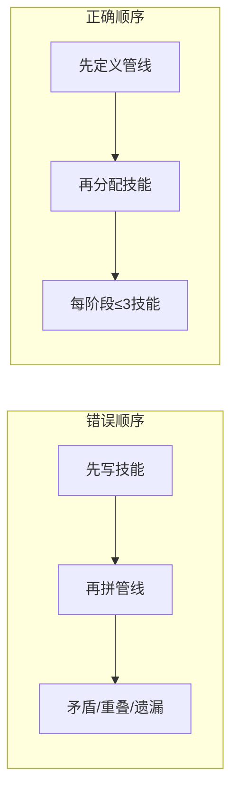

# OPSV 技能包创建引擎 (OPSV Skills Pack Creator)

> **产地**: Dragon_Ball 漫剧技能包创建实战提炼
> **原理**: 所有 OPSV 技能包都遵循同一套底层模式 —— 管线先行、分类驱动、校验闭环

本技能封装了创建任何 OPSV 技能包的 **7 条核心原则** + **7 步脚手架流程**。它不是模板复制工具，而是**设计方法论引擎**——帮你从原始想法推演出完整的技能包架构。

---

## 原则一：管线先行 (Pipeline-First)

**任何技能包都应该先定义管线，再写技能。**



### 管线定义三要素

| 要素 | 要求 | 追问 |
|------|------|------|
| **阶段划分** | 一个生产步骤 = 一个阶段 | 视频生产从哪开始到哪结束？ |
| **输入/产出** | 每阶段有明确的产物文档 | 上阶段给我什么？我交给下阶段什么？ |
| **验收标准** | 可执行的验证命令 | 怎么判断"做完了"？ |

### 铁律

> **每阶段 ≤3 个技能**。如果一个阶段需要 4+ 个技能，说明阶段划分太粗，拆细。

### Dragon_Ball 案例

```
S0 项目破题 → S1 剧本创作 → S2 分镜设计 → S3 视觉资产生成 → S4 视频生成 → S5 声音设计 → S6 后期/复盘
 1技能         1技能          1技能           1技能                1技能         1技能         1技能
```

7 个阶段，每阶段 1 技能，产消分明。

---

## 原则二：门控关卡 (Gate-Controlled)

**每个阶段是一个门控关卡：不合格的产物不允许流入下一阶段。**

### 门控三问

每一阶段结束时，Guardian 或自动化流程必须回答：

1. **产物存在吗？** → 文件在预期路径吗？（`ls | grep`）
2. **文档合规吗？** → frontmatter 必填字段齐全吗？（`opsv validate --category X`）
3. **引用完整吗？** → refs 指向的文档都存在且被反向引用吗？（`opsv refs check`）

### 门控状态

```
drafting ──→ reviewing ──→ approved ──→ locked
     ↑            │
     └── rejected ┘
```

- **drafting**: 创作中，可以改
- **reviewing**: 提交验收，不可改
- **approved**: 通过，流入下阶段
- **locked**: 下阶段已使用，只读（防级联修改）

### Dragon_Ball 案例

```yaml
验收(S3): opsv review → approve + asset_id 不为 null
验收(S4): opsv review → 角色一致性 + 无乱码
```

---

## 原则三：分类驱动 (Category-Driven)

**OPSV 的 `category` 字段是技能包的骨架。文档类型 = category 值。**

### 分类设计三步法

```
Step 1: 列出所有需要创建的文档类型
  角色设计、场景设计、分镜镜头、配音文件 …

Step 2: 分配 category 命名
  comic_character, comic_scene, comic_storyboard, comic_voice …

Step 3: 为每个 category 定义验证规则
  → 写入 category_validate.yaml
```

### 分类二象性

| 分类 | 特征 | 验证差异 | 示例 |
|------|------|---------|------|
| **视觉生成类** | 最终会生成图片/视频 | prompt 必检（min_length, no_placeholder） | comic_character, comic_storyboard |
| **非视觉/分析类** | 纯文档，用于指导生产 | 跳过 prompt 检查，聚焦结构完整性 | comic_project, comic_framing, comic_voice |

### 铁律

> **每个 category 必须有验证规则**。无验证规则的 category = 无人看管的文档 = 迟早被遗忘。

### 系统保留命名

以下命名已被 OPSV 引擎占用，**自定义 category 和文档文件名不得与之重叠**：

| 保留项 | 类型 | 说明 |
|--------|------|------|
| `shotdeck` | 文档文件名 | `shotdeck.md` 是批量视频编译的入口文档，依赖图中检测到该文件时尾环自动命名为 `end_circle` |
| `shot-design` | category 值 | 分镜设计文档类型，对应专用 `ShotDesignFrontmatterSchema`（含 `title`、`total_shots`、`style`） |
| `shot-production` | category 值 | 分镜生成文档类型，对应专用 `ShotProductionFrontmatterSchema`（含 `frame_ref`、`first_frame`、`last_frame`、`duration`、`video_path`） |
| `project` | category 值 | 项目元数据文档类型，对应 `ProjectFrontmatterSchema`（含 `aspect_ratio`、`resolution`、`vision`） |
| `@FRAME:` | refs 语法 | 帧引用语法（`@FRAME:shotId_first` / `@FRAME:shotId_last`），用于引用其他文档的生成产物而非源资产，是一种特殊的引用维度 |

> 这些保留项是 OPSV 引擎中尚未完全泛化的硬编码部分。在未来的重构中可能被解构为通用机制，但在此之前，自定义技能包不应侵占这些命名空间。

---

## 原则四：文档即契约 (Document-as-Contract)

**每份文档是 OPSV 可读的 markdown，含 frontmatter + 正文。Frontmatter 是契约，正文是内容。**

### 必填结构

```yaml
---
category: <category值>     # 由原则三决定
status: drafting            # 由原则二的门控状态管理
title: "有意义的标题"       # 让人一眼看懂
created: "2026-06-15"      # 创建日期
# + 每个 category 特有的必填字段
---
```

### 文档层级

| 层级 | 位置 | 特征 |
|------|------|------|
| **项目级** | 根目录: `project.md` | 全局元数据，1 份 |
| **元素级** | `elements/@*.md` | 角色、道具等复用资产，N 份 |
| **场景级** | `scenes/*.md` | 场景定义，N 份 |
| **分镜级** | `storyboard/shot_NN.md` | 逐镜设计，N 份 |
| **资产级** | `shot/`, `voice/`, `episode/` | 输出产物 |

### 铁律

> **所有文档必须在 videospec/ 目录下**，经过 `opsv validate` 验证。不在 videospec 里的文档 = 不存在。
> **创建即验证**：每个创建文档的技能必须在工作流中包含 `opsv validate --category <category>` 步骤。不验证 = 文档未完成创建。

---

## 原则五：引用图谱 (Refs DAG)

**文档之间通过 `refs` 字段形成有向无环图。每条 ref 必须双向可追溯。**

### @-refs 语法

```yaml
---
refs:
  image:
    - "@lu_ran"        # 引用角色
    - "@xuan_wei"      # 引用角色
    - "throne_hall"    # 引用场景
---
```

### 校验规则

| 规则 | 检查 | 失败后果 |
|------|------|---------|
| **存在性** | refs 指向的文档必须存在 | opsv validate 报 dead reference |
| **反向性** | 被引文档的 refs 是否引回当前文档 | opsv refs check 报 missing backlink |
| **无环性** | 不形成 A→B→C→A 循环 | opsv refs check --dag 报 cycle |
| **使用验证** | @-refs 必须出现在正文 prompt 中 | 自定义规则: refs_in_prompt_must_match_refs |

### Dragon_Ball 案例

```
shot_09.md refs: @lu_ran, @yun_li, stele_shrine
  → @lu_ran.md refs: shot_09（反向引用）
  → @yun_li.md refs: shot_09（反向引用）
  → stele_shrine.md refs: shot_09（反向引用）
  → 全部校验通过 ✅
```

---

## 原则六：技能隔离 (Skill Isolation)

**每个技能只做一件事，只写自己所属目录的文件。**

### 技能合同

```yaml
职责边界:
  你做: <列举 3-5 项>
  你不做: <列举 3-5 项>
```

### 目录所有权

```
skills/comic-creative/SKILL.md     → 写 elements/ 和 scenes/
skills/comic-storyboard/SKILL.md  → 写 storyboard/
skills/comic-seedance/SKILL.md    → 写 elements/previs/ 和 shot/
skills/comic-voice/SKILL.md       → 写 voice/
skills/comic-post/SKILL.md        → 写 episode/ 和 review/
```

### 技能文件结构

```
skills/<skill_name>/
├── SKILL.md              # 技能定义（必选）
├── references/           # 模板/模式/示例（可选）
│   ├── template_A.md
│   └── template_B.md
└── guides/               # 教 AI 怎么用的高级指南（可选）
    └── how-to-category-x.md
```

### 铁律

> **一个技能不能写两个不同阶段的目录**。例外：一个技能跨两个连续阶段（如 comic-seedance 管 S3+S4），但需在管线文档中显式标注。

---

## 原则七：渐进构建 (Progressive Build)

**不要一口气建完所有东西。按依赖顺序，逐层构建。**

### 构建顺序

```
Layer 0: AGENTS.md + 决策
  → 确定技能包的目标、受众、生产范式
  
Layer 1: 管线定义 (pipeline/SKILL.md)
  → 7 阶段门控 + 输入/产出/验收
  
Layer 2: 技能定义 (skills/*/SKILL.md)
  → 每个技能绑定到管线阶段
  
Layer 3: 分类验证 (category_validate.yaml)
  → 每个文档类型 + 验证规则
  
Layer 4: 代码指南 (guides/*.md)
  → 提示词写法、工作流方法论、文档模板
  
Layer 5: 守护验收 (Guardian-Agent)
  → 门控的自动化验证
  
Layer 6: 实战打磨
  → 跑一个真实项目 → 复盘 → 迭代规则
```

### 每个 Layer 的可交付

| Layer | 最小可行产物 | 验证方法 |
|-------|-------------|---------|
| 0 | AGENTS.md 读完能说清"做什么" | 人工评审 |
| 1 | pipeline/SKILL.md 定义清晰 | `opsv validate` 通过 |
| 2 | 每个 SKILL.md 有职责边界 | 技能间无重叠 |
| 3 | 每个 category 有规则 | `opsv validate` 全过 |
| 4 | guide 有第一个实战案例 | AI 能按 guide 写出可用的东西 |
| 5 | Guardian 能阻断不合格产物 | 自动化测试 |
| 6 | 复盘记录中存在改进项 | 回顾模板已使用 |

### Dragon_Ball 的实际构建路径

```
第 1 轮: 导入 refs-pack → 定义文件规范(0)
第 2 轮: 分阶段门控 → 5阶段管线(1)
第 3 轮: 逐个技能 → comic-creative, storyboard, seedance(2)
第 4 轮: category_validate.yaml 修复 → voice/storyboard/prompt(3)
第 5 轮: 方法论提炼 → workflow-methodology(4)
第 6 轮: Seedance 提示词 → seedance-prompt-spec(4)
第 7 轮: 阶段零扩展 → comic-director + 4新category(2+3)
第 8 轮: opsv-pack-creator → 元技能提炼(当前)
```

---

## 脚手架流程：7 步创建新技能包

### Step 0: 初始化

```bash
mkdir -p opsv-packs/<pack-name>/.agent/{skills,guides}
cd opsv-packs/<pack-name>

# 创建 videospec 目录（OPSV 必需）
mkdir -p videospec/directive
```

**产物目录结构：**
```
opsv-packs/<pack-name>/
├── .agent/
│   ├── skills/      ← 后续填充：skills/*/SKILL.md
│   └── guides/      ← 后续填充：guides/*.md
└── videospec/
    └── directive/   ← 阶段零产出
```

### Step 1: 用户画像

创建 `.agent/USER.md`：

```markdown
# 用户画像

- **身份**: 对 XXX 有高要求的 YYY
- **风格**: ZZZ
- **痛点**: <他为什么需要这个技能包>
- **质量标杆**: <什么算"做得好">
```

**产物：**
```
.agent/
├── USER.md           ✦ 新增
├── skills/
└── guides/
```

### Step 2: 代理人设

写 `.agent/AGENTS.md`，定义角色生态：

```markdown
# <技能包名> Agent 系统

## 身份
你服务于 <用户描述> ...

## 角色四元组

| 角色 | 技能手册 | 一句话职责 |
|------|---------|-----------|
| **Role-A** | skills/A/SKILL.md | ... |
| **Role-B** | skills/B/SKILL.md | ... |
| **Guardian-Agent** | skills/guardian/SKILL.md | 验证/门控 |
| **Runner-Agent** | skills/runner/SKILL.md | 执行/AI API 调用 |
```

**产物：**
```
.agent/
├── USER.md
├── AGENTS.md         ✦ 新增
├── skills/
└── guides/
```

### Step 3: 管线定义

写 `skills/pipeline/SKILL.md` — 定义生产阶段：

```
S0 项目破题 → S1 ... → S2 ... → S3 ...
```

每阶段注明：
- 负责技能
- 输入产物路径
- 输出产物路径
- 验收命令

**产物：**
```
.agent/
├── USER.md
├── AGENTS.md
├── skills/
│   └── pipeline/
│       └── SKILL.md   ✦ 新增
└── guides/
```

### Step 4: 分类注册

定义 `videospec/_category_validate.yaml` — 每个文档类型对应一个规则块：

```yaml
category_name:
  required_fields:
    - status
    - title
    - field_X
  required_file_prefix: "path/"    # 可选：限定文件位置
  skip_prompt_check: true          # 非视觉类设为 true
  rules:
    - name: field_X 非空
      type: min_length
      field: field_X
      min: 1
```

> 同时创建 `.opsv/category_validate.yaml`（源文件），标注同步说明。

### Step 5: 技能编写

为每个阶段创建 `skills/<name>/SKILL.md`：

> **铁律：创建即验证（Create-and-Validate Pattern）**
> 
> 每个创建文档的技能，在其工作流最后一步必须包含 `opsv validate` 验证。
> 这是文档即契约原则的落地：创建文档不验 = 契约未签字。
> 
> 在工作流的"输出"前加入：
> ```bash
> # 创建文档后立即验证
> opsv validate --category <当前技能负责的category>
> ```
> 
> 验证确保：frontmatter 字段齐全、必填项非空、引用一致性、无占位符残留。
> 不通过则返回修正，不生成不合格产物。

```markdown
---
name: <skill-name>
description: 一句话描述
---

# <技能名>

> **管线位置**: 阶段 X · <阶段名> (Stage X)
> **输入**: <产物路径>
> **产物**: <产物路径>
> **技能数**: 1（本技能独占本阶段）
> **验收**: <验证命令>

## 职责边界

**你做**：<3-5 项>
**你不做**：<3-5 项>

## 工作流程

...
```

**产物：**
```
.agent/
├── USER.md
├── AGENTS.md
├── skills/
│   ├── pipeline/SKILL.md
│   ├── <skill-A>/SKILL.md   ✦ 新增
│   ├── <skill-B>/SKILL.md   ✦ 新增
│   ├── guardian/SKILL.md    ✦ 新增
│   └── runner/SKILL.md      ✦ 新增
└── guides/
```

参考文件参见 `references/skill-skeleton.md`。

### Step 6: 指南编写

为复杂技能编写 `guides/*.md`：
- 提示词书写规范（视觉类必选）
- 工作流方法论（有多阶段协同的必选）
- 文档模板规范（产出物复杂时选用）

**产物：**
```
.agent/
├── USER.md
├── AGENTS.md
├── skills/
│   ├── pipeline/SKILL.md
│   ├── <skill-A>/SKILL.md
│   ├── <skill-B>/SKILL.md
│   ├── guardian/SKILL.md
│   └── runner/SKILL.md
├── guides/
│   ├── prompt-spec.md     ✦ 可选，视觉类必写
│   └── workflow-methodology.md  ✦ 可选
└── references/
    └── skill-skeleton.md  ✦ 可选，脚手架参考
```

### Step 7: 验收闭环

```bash
# 1. 验证管线定义文档
opsv validate

# 2. 检查所有技能 SKILL.md 是否有管线标注
grep -r "管线位置" skills/*/SKILL.md | wc -l

# 3. 验证 category 规则
opsv validate --category <每个自定义category>

# 4. 运行一个最小实战：创建一份文档测试
# 修改 status 为 reviewing → 模拟 Gate 通过
```

**完整技能包目录结构：**
```
项目根目录/
├── .agent/
│   ├── USER.md
│   ├── AGENTS.md
│   ├── skills/
│   │   ├── pipeline/SKILL.md
│   │   ├── <skill-A>/SKILL.md
│   │   ├── <skill-B>/SKILL.md
│   │   ├── guardian/SKILL.md
│   │   └── runner/SKILL.md
│   └── guides/
│       └── ...
├── .opsv/
│   └── category_validate.yaml    ✦ 源文件
├── videospec/
│   ├── _category_validate.yaml   ✦ 运行文件（与 .opsv/ 同步）
│   └── directive/                ← 空，等待阶段零执行
└── （其他 OPSV 项目文件）
```

## 设计模式速查表

| 模式 | 适用场景 | Dragon_Ball 示例 |
|------|---------|-----------------|
| **Refs 驱动** | 需要跨镜头角色一致性的漫画 | comic-seedance: GPT Image 2 Previs + Asset ID |
| **帧驱动** | 已有逐帧素材，需编排成漫画 | comic-frame-pack: ComfyUI 4 帧分镜 |
| **纯提示词** | 短内容、单镜头、无需资产引用 | Seedance 纯文本模式 |
| **两级工作流** | 先设计后生成，不可跳级 | comic-voice: 声线设计 → 镜头配音 |
| **阶段零破题** | 原始材料不是视频格式 | comic-director: 四问 + 三遍阅读法 |
| **产消合一** | 同一素材多平台复用 | 同一 episode 输出 16:9 / 9:16 / 1:1 |

---

## 参考

- **Dragon_Ball 完整实现**: `test/opsv-packs/skills/Dragon_Ball/`
- **OPSV 核心概念**: `../opsv-packs/skills/opsv/SKILL.md`

---

> *本技能本身也是原则七（渐进构建）的产物 — 它来自 Dragon_Ball 第 8 轮迭代的元认知提炼。*
