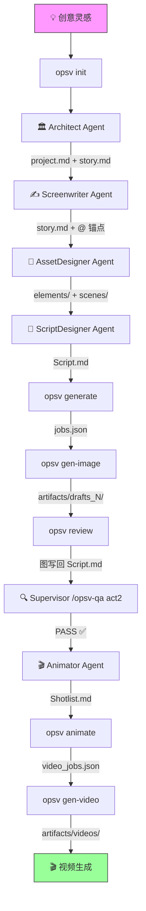

# OpsV 工作流程说明 (Workflow Guide)

> 从灵感到成片的五步循环，理解 Agent 协作与 CLI 命令的完整交互逻辑。

---

## 全景流程图



---

## 阶段一：项目初始化 (Init)

### 触发命令
```bash
opsv init [projectName]
```

### 发生了什么
1. **交互式选择** AI 助手（Gemini / OpenCode / Trae）
2. **复制模板**：
   - `.agent/` — Agent 角色定义 + Skills 技能手册
   - `.antigravity/` — 工作流和行为规则
   - `.env/` — API 配置模板
   - `GEMINI.md` / `AGENTS.md` — 按选择复制
3. **创建目录骨架**：
   - `videospec/stories/`、`videospec/elements/`、`videospec/scenes/`、`videospec/shots/`
   - `artifacts/`、`queue/`

### 产物
```
my-project/
├── .agent/skills/...
├── .env/api_config.yaml
├── videospec/
│   ├── stories/
│   ├── elements/
│   ├── scenes/
│   └── shots/
├── artifacts/
└── queue/
```

---

## 阶段二：创意锚定 (Concept Anchoring)

### 负责 Agent
**Architect** → 调用 `opsv-architect` 技能

### 两阶段工作流

#### Phase 1：概念发散
- 输入：一句歌词、一段旋律描述或一个模糊概念
- 输出：**3 个差异化的故事方案**，每个方案包含：
  - 方案标题（一句话）
  - 核心情节（3-5 句话）
  - 视觉风格关键词
  - 核心角色清单
  - 预估镜头数
- **此阶段不生成任何文件**

#### Phase 2：世界观锚定
- 导演选择方案后，生成两个核心文件：
  - `videospec/project.md` — 全局参数 + 资产花名册
  - `videospec/stories/story.md` — 叙事大纲（含 `@` 实体锚点）

### 示例

导演说："一首关于蝴蝶的歌，很空灵"

→ Architect 产出：
```yaml
# videospec/project.md
---
aspect_ratio: "16:9"
engine: ""
vision: "一只破茧蝴蝶的孤独飞行，穿越四季的极简之美"
global_style_postfix: "ethereal atmosphere, minimalist composition, soft bokeh, dreamlike quality, 8k"
---

# Asset Manifest
## Main Characters
- @role_butterfly
## Scenes
- @scene_cocoon
- @scene_spring_forest
```

### 质检门禁
完成后可运行 `/opsv-qa act1`，由 Supervisor 核查资产清单是否完整。

---

## 阶段三：资产设计 (Asset Design)

### 负责 Agent
**AssetDesigner** → 调用 `opsv-asset-designer` 技能

### 核心任务
为 `project.md` 花名册中列出的每个实体创建独立的 `.md` 定义文件。

### 工作规则

> 详细规范见 [OPSV-ASSET-0.4](schema/OPSV-ASSET-0.4.md)

1. **先读全局上下文**：必须读取 `project.md` 了解时代氛围和风格
2. **双通道参考图体系**：
   - `## Design References`（d-ref）：放入生成本实体时需要的输入参考图（灵感图、已有资产的 a-ref 用于变体生成）
   - `## Approved References`（a-ref）：放入定档后的正式参考图（经 `opsv review` 审批确认）
   - 两节均为空时 → 纯文生图，使用 `detailed_description`
   - 任一节非空时 → 使用 `brief_description` + 参考图
3. **YAML 存元数据，Markdown Body 存参考图链接** — 用户只维护一处

### 产物示例

```markdown
# videospec/elements/@role_butterfly.md
---
name: "@role_butterfly"
type: "character"
detailed_description: >
  一只翅膀如彩色玻璃般的凤蝶，翼展约15厘米。上翅为深邃的靛蓝色，
  边缘渐变为琥珀色，布满细密的金色鳞粉...
brief_description: "靛蓝渐变琥珀色的凤蝶，翅膀如彩色玻璃"
prompt_en: >
  A swallowtail butterfly with indigo-to-amber gradient wings,
  golden scale dust, glass-like transparency, macro photography,
  ethereal backlighting, 8k ultra detailed...
---

## Design References
- [蝴蝶翅膀纹理参考](refs/butterfly_wing_texture.jpg)
- [琥珀色调光影参考](refs/amber_lighting_mood.png)

## Approved References
<!-- opsv review 审批后回写 →
- [蝴蝶三视图](artifacts/drafts_2/role_butterfly_turnaround.png)
-->
```

### 变体链示例

```markdown
# videospec/elements/@role_butterfly_aged.md — 老化版蝴蝶
---
name: "@role_butterfly_aged"
type: "character"
brief_description: "翅膀褪色破损的老年凤蝶"
prompt_en: "An aged swallowtail butterfly, faded colors, torn wing edges..."
---

## Design References
- [年轻版定档图 - 作为老化基础](artifacts/drafts_2/role_butterfly_turnaround.png)
- [老化纹理参考](refs/aged_wing_texture.jpg)
```

### 质检门禁
`/opsv-qa act1` — 核查所有文件是否已在 `project.md` 花名册中登记。

---

## 阶段四：分镜编译与审阅 (Script → Generate → Review)

这是最核心的循环，包含 3 个子步骤。

### 4.1 分镜设计

**负责 Agent**：**ScriptDesigner** → 调用 `opsv-script-designer` 技能

- 阅读 `story.md`，将叙事转化为结构化镜头语言
- 输出 `videospec/shots/Script.md`（YAML 数组 + Markdown 审阅正文）
- 每个 Shot 设计时长 **3-5 秒**，上限 **15 秒**
- 分镜中**严禁刻画角色外貌**，必须用 `@实体名` 引用

```yaml
# videospec/shots/Script.md (YAML 区)
---
shots:
  - id: "shot_1"
    duration: 5
    camera: "极致微距，紧贴茧壳表面"
    environment: "@scene_cocoon 破晓薄雾中"
    subject: "@role_butterfly 破茧瞬间"
    prompt_en: "Extreme macro shot of a butterfly emerging from chrysalis..."
  - id: "shot_2"
    duration: 4
    camera: "广角仰拍"
    environment: "@scene_spring_forest"
    subject: "@role_butterfly 首次振翅"
    prompt_en: "Low angle wide shot, butterfly's first wing spread..."
---
```

### 4.2 图像生成

```bash
# 编译 Markdown 为 JSON 任务
opsv generate

# 执行图像渲染（默认同时调度 api_config.yaml 中所有启用的模型）
# 结果落盘至 artifacts/drafts_N/[引擎供应商]/ 下，形成“平行宇宙沙箱”
opsv gen-image

# 可选：预览模式（只生成关键镜头）
opsv generate --preview

# 可选：只生成指定镜头
opsv generate --shots 1,3,5
```

### 4.3 文档审阅

```bash
# 将最新的生成结果回写到 .md 文档
opsv review

# 回写所有历史批次
opsv review --all
```

执行 `opsv review` 后，`Script.md` 的 Markdown 正文区会出现图片链接：

```markdown
## Shot 1 (5s)
[@role_butterfly](../elements/@role_butterfly.md) 在 [@scene_cocoon] 中破茧而出

### 🖼️ 视觉审阅廊
| 画面 1 | 画面 2 |
|:---:|:---:|
|  |  |
```

导演在 IDE 预览中选出最佳草图，批注确认。

### 质检门禁
- `/opsv-qa act2` — 扫描死链、检查超链接完整性
- `/opsv-qa act3` — 预警分镜中的特征泄漏

---

## 阶段五：动画编导 (Animation)

### 负责 Agent
**Animator** → 调用 `opsv-animator` 技能

### 核心任务
读取已审阅确认的 `Script.md`，提取纯动态控制指令，输出 `Shotlist.md`。

### 动静分离原则
- **不描述**穿什么衣服（已有参考图）
- **只描述**：镜头怎么动？角色怎么动？场景有什么动态变化？
- `motion_prompt_en` 必须**全英文**

### 产物示例

```yaml
# videospec/shots/Shotlist.md
---
shots:
  - id: shot_1
    duration: 5s
    reference_image: "../artifacts/drafts_1/shot_1_draft_2.png"
    motion_prompt_en: "Extreme macro, chrysalis slowly cracks open, tiny legs push through, morning dew drops tremble on the surface, ultra smooth cinematic motion."
  - id: shot_2
    duration: 4s
    reference_image: "../artifacts/drafts_1/shot_2_draft_1.png"
    first_image: "@FRAME:shot_1_last"
    motion_prompt_en: "Camera slowly pulls back to wide angle, butterfly spreads wings for the first time, sunlight catches the iridescent scales, gentle breeze rustles leaves."
---
```

### 编译发布

```bash
# 将 Shotlist.md 编译为视频任务队列
opsv animate

# 执行视频生成（默认调度所有开启的视频模型如 Minimax、Seedance 等）
opsv gen-video
```

### 长镜头继承
当连续运动需要无缝衔接时，后续 Shot 的 `first_image` 设为 `@FRAME:<前一个shot_id>_last`，系统会自动截取前一视频的尾帧作为下一镜头的首帧。

### 质检门禁
`/opsv-qa final` — Payload 断言检查，确认全局风格后缀注入与参考图路径一致性。

---

## 质检体系总览

| Slash 命令 | 阶段 | 检查内容 |
|-----------|------|---------|
| `/opsv-qa act1` | 编剧后 | 资产花名册是否完整，无黑户无重复 |
| `/opsv-qa act2` | 选图后 | 死链扫描，参考图路径是否存在 |
| `/opsv-qa act3` | 分镜后 | 特征泄漏预警，防止容貌描写渗透分镜 |
| `/opsv-qa final` | 编译后 | Payload 断言，风格后缀注入 + 参考图对齐 |

所有质检由 **Supervisor Agent** 执行，输出红绿灯报告：
- 🟢 `PASS: 针脚严丝合缝`
- 🔴 `FAIL: 扫出 2 个未登记黑户：@xxx, @yyy`

---

## 循环迭代

以上五个阶段并非一次通过。实际场景中，导演会基于审阅结果反复迭代：

```
Script → Generate → gen-image → Review → (不满意) → 修改资产/分镜 → Generate → gen-image → Review → (OK)
                                                          ↑
                                                    opsv-apply 批量修改
```

`opsv-apply` 技能可以批量读取变更提案（`videospec/changes/*.md`）并自动执行资产更新。

---

> *"让创意如流水般流淌，让规范如堤坝般坚固。"*
> *OpsV 0.4.3 | 最后更新: 2026-03-28*
