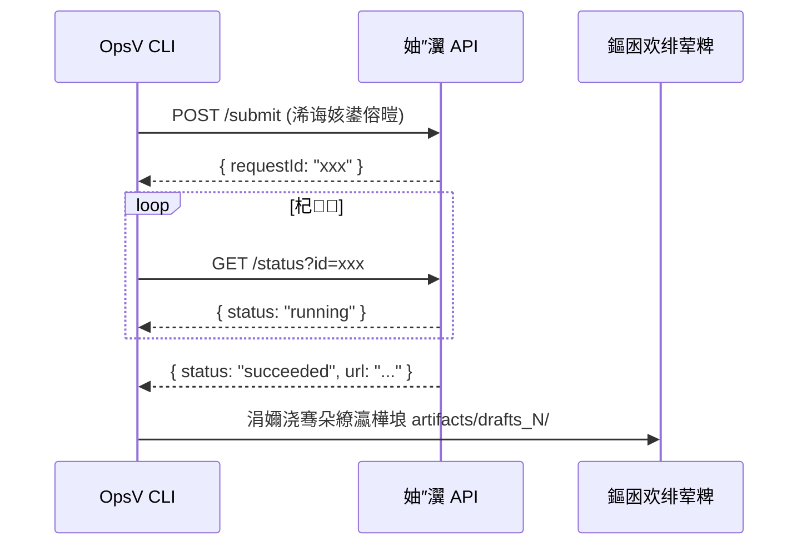

# OpsV 澶氭ā鍨?API 鎺ュ彛瑙勮寖 (API Reference)

> 瀹氫箟 OpsV 鏀寔鐨勫悇绫荤敓鎴愭ā鍨嬬殑鎺ュ彛鏍煎紡銆佹暟鎹被鍨嬪強浜や簰鍗忚銆?

---

## 1. 鏍稿績浜や簰妯″紡

OpsV 閲囩敤 **"鎻愪氦-杞-涓嬭浇"** 鐨勫紓姝ユā寮忥細



---

## 2. 缁熶竴浣滀笟瀵硅薄 (Internal Job Object)

鎵€鏈夋ā鍨嬬殑浠诲姟鍦?OpsV 鍐呴儴浣跨敤缁熶竴鐨?Job 鏍煎紡锛?

```typescript
interface Job {
  id: string;                          // 鍞竴鏍囪瘑锛堝 "shot_1_element_role_K"锛?
  type: "image_generation" | "video_generation";
  prompt_en: string;                   // 鑻辨枃娓叉煋鎻愮ず璇?
  reference_images?: string[];         // 鍙傝€冨浘鏈湴璺緞鏁扮粍
  output_path: string;                 // 杈撳嚭缁濆璺緞
  payload: {
    prompt: string;                    // 涓枃鍙欎簨涓婁笅鏂?
    duration?: string;                 // 瑙嗛鏃堕暱
    global_settings: {
      quality: "480p" | "720p" | "1080p" | "2K" | "4K";
    };
    schema_0_3?: {
      first_image?: string;            // 棣栧抚鍙傝€冨浘璺緞
      last_image?: string;             // 灏惧抚鍙傝€冨浘璺緞
      reference_images?: string[];     // 瑙掕壊鐗瑰緛鍙傝€冨浘
    };
  };
}
```

---

## 3. ByteDance Seedance 1.5 Pro

### 3.1 鎻愪氦鎺ュ彛 (Submit)

| 椤圭洰 | 鍊?|
|------|---|
| **Endpoint** | `https://ark.cn-beijing.volces.com/api/v3/video/submit` |
| **Method** | `POST` |
| **閴存潈** | `Authorization: Bearer <VOLCENGINE_API_KEY>` |

**璇锋眰浣?*锛?
```json
{
  "model": "doubao-seedance-1-5-pro",
  "prompt": "Camera slowly orbits around the character...",
  "resolution": "720p",
  "aspect_ratio": "16:9",
  "duration": 5,
  "fps": 24,
  "image": "data:image/jpeg;base64,...",
  "last_image": "data:image/jpeg;base64,...",
  "sound": true
}
```

| 鍙傛暟 | 绫诲瀷 | 蹇呭～ | 璇存槑 |
|------|------|------|------|
| `model` | string | 鉁?| 鍥哄畾鍊?`doubao-seedance-1-5-pro` |
| `prompt` | string | 鉁?| 鑻辨枃鍔ㄦ€佹弿杩?|
| `resolution` | string | 鉁?| `480p` / `720p` / `1080p` |
| `aspect_ratio` | string | - | `16:9` / `9:16` / `1:1` / `4:3` / `3:4` / `21:9` / `adaptive` |
| `duration` | integer | - | 鏁存暟绉?|
| `fps` | integer | - | 鍥哄畾 `24` |
| `image` | string | - | 棣栧抚 Base64锛坄data:image/jpeg;base64,...`锛?|
| `last_image` | string | - | 灏惧抚 Base64 |
| `sound` | boolean | - | 寮€鍚┖闂撮煶棰?|

### 3.2 鐘舵€佹煡璇?(Status)

| 椤圭洰 | 鍊?|
|------|---|
| **Endpoint** | `https://ark.cn-beijing.volces.com/api/v3/video/status?id=<requestId>` |
| **Method** | `GET` |

**鍝嶅簲浣?*锛?
```json
{
  "status": "succeeded",
  "video_url": "https://...",
  "error_message": ""
}
```

| status 鍊?| 鍚箟 |
|-----------|------|
| `pending` | 鎺掗槦涓?|
| `running` | 鐢熸垚涓?|
| `succeeded` | 鎴愬姛锛堝寘鍚?`video_url`锛?|
| `failed` | 澶辫触锛堝寘鍚?`error_message`锛?|

---

## 4. SiliconFlow Wan 2.1

### 4.1 鎻愪氦鎺ュ彛 (Submit)

| 椤圭洰 | 鍊?|
|------|---|
| **Endpoint** | `https://api.siliconflow.cn/v1/video/submit` |
| **Method** | `POST` |
| **閴存潈** | `Authorization: Bearer <SILICONFLOW_API_KEY>` |

**璇锋眰浣?*锛?
```json
{
  "model": "wan-ai/Wan2.1-T2V-14B",
  "prompt": "A butterfly emerging from chrysalis...",
  "image_size": "1280x720"
}
```

### 4.2 鐘舵€佹煡璇?(Status)

| 椤圭洰 | 鍊?|
|------|---|
| **Endpoint** | `https://api.siliconflow.cn/v1/video/status` |
| **Method** | `POST` |

**璇锋眰浣?*锛?
```json
{
  "requestId": "..."
}
```

**鍝嶅簲浣?*锛?
```json
{
  "status": "Succeed",
  "results": {
    "videos": [
      { "url": "https://..." }
    ]
  }
}
```

| status 鍊?| 鍚箟 |
|-----------|------|
| `InQueue` | 鎺掗槦涓?|
| `InProgress` | 鐢熸垚涓?|
| `Succeed` | 鎴愬姛 |
| `Failed` | 澶辫触 |

---

## 5. SeaDream 5.0 (鍥惧儚鐢熸垚)

### 5.1 鎻愪氦鎺ュ彛 (Submit)

| 椤圭洰 | 鍊?|
|------|---|
| **Endpoint** | `https://api.volcengine.com/visual/image_generation/2024-08-01` |
| **Method** | `POST` |
| **閴存潈** | `Authorization: Bearer <VOLCENGINE_API_KEY>` |

**璇锋眰浣?*锛?
```json
{
  "req_key": "high_definition_generation",
  "prompt": "A swallowtail butterfly with indigo wings...",
  "model_version": "seadream_5_0",
  "aspect_ratio": "16:9",
  "size": "2K",
  "width": 1024,
  "height": 1024
}
```

| 鍙傛暟 | 绫诲瀷 | 蹇呭～ | 璇存槑 |
|------|------|------|------|
| `req_key` | string | 鉁?| 鍥哄畾鍊?`high_definition_generation` |
| `prompt` | string | 鉁?| 鐢熸垚鎻愮ず璇?|
| `model_version` | string | 鉁?| 鍥哄畾鍊?`seadream_5_0` |
| `aspect_ratio` | string | - | 瀹樻柟棰勮鐢诲箙 |
| `size` | string | - | `2K` / `3K` / `4K` |
| `width` / `height` | integer | - | 涓嶄娇鐢?`size` 鏃剁殑鑷畾涔夊儚绱?|

### 5.2 鍝嶅簲鏍煎紡

```json
{
  "data": {
    "binary_data_base64": ["..."],
    "image_urls": ["https://..."]
  }
}
```

> **娉ㄦ剰**锛歋eaDream 鏄悓姝ユ帴鍙ｏ紝鏃犻渶杞銆?

---

## 6. 寮傚父澶勭悊鍗忚 (Defensive Protocol)

鎵€鏈?Provider 瀹炵幇蹇呴』閬靛惊浠ヤ笅涓夊ぇ闃插尽鎬х紪绋嬪噯鍒欙細

### 6.1 娣卞害绌块€忚В鏋?(Deep Penetrative Parsing)

API 杩斿洖浣撶殑缁撴瀯鍙兘涓嶄竴鑷淬€傚繀椤诲吋瀹瑰绉嶅祵濂楋細

```typescript
// 闃插尽鎬ф彁鍙?
const id = data?.id || data?.data?.id || data?.data?.[0]?.id;
const result = Array.isArray(data) ? data[0] : data;
```

### 6.2 寮哄姏璇佹嵁寮忔棩蹇?(Evidential Logging)

绂佹杩斿洖妯＄硦鐨?`undefined`銆傛墍鏈夊紓甯稿繀椤昏褰曞師濮?JSON锛?

```typescript
catch (error) {
  logger.error('API Error', {
    status: error.response?.status,
    data: JSON.stringify(error.response?.data),
    message: error.message,
  });
}
```

### 6.3 Axios 闃茬┖閫昏緫 (Axios Defensive Handling)

鍖哄垎缃戠粶閿欒鍜屼笟鍔￠敊璇細

```typescript
catch (error) {
  if (!error.response) {
    // 缃戠粶灞傞敊璇紙瓒呮椂銆丏NS 澶辫触绛夛級
    logger.error(`Network error: ${error.code}`); // ETIMEDOUT, ECONNREFUSED
  } else {
    // 涓氬姟灞傞敊璇紙API 杩斿洖鐨勯敊璇爜锛?
    logger.error(`API error ${error.response.status}: ${JSON.stringify(error.response.data)}`);
  }
}
```

---

## 7. 鏂版ā鍨嬫帴鍏ユ寚鍗?

### Step 1锛氱爺绌跺畼鏂规枃妗?
鑾峰彇鐩爣妯″瀷鐨?API 绔偣銆侀壌鏉冩柟寮忋€佽姹?鍝嶅簲鏍煎紡銆?

### Step 2锛氭洿鏂伴厤缃?
鍦?`.env/api_config.yaml` 鍜?`templates/.env/api_config.yaml` 涓坊鍔犳ā鍨嬮厤缃€?

### Step 3锛氬疄鐜?Provider
鍦?`src/executor/providers/` 涓垱寤烘柊鐨?Provider 绫伙紝瀹炵幇鎻愪氦鍜岃疆璇㈤€昏緫銆?

### Step 4锛氭敞鍐?Dispatcher
鍦?`ImageModelDispatcher` 鎴?`VideoModelDispatcher` 涓敞鍐屾柊 Provider 鐨勬槧灏勩€?

### Step 5锛氭洿鏂版枃妗?
鍦ㄦ湰鏂囨。涓坊鍔犳柊妯″瀷鐨勬帴鍙ｆ弿杩般€?

### Step 6锛氱紪鍐欐祴璇?
鍦?`test/` 鐩綍涓嬫坊鍔?Provider 鐨勫崟鍏冩祴璇曪紙浣跨敤 mock锛夈€?

> [!IMPORTANT]
> 浠讳綍鏂版ā鍨嬬殑鎺ュ彛鍙傛暟蹇呴』涓ユ牸渚濇嵁瀹樻柟 API 鏂囨。锛屼弗绂佸嚟绌烘兂璞℃垨娌跨敤閫氱敤鍙傛暟鍚嶃€?

---

> *"鎺ュ彛鍗冲悎绾︼紝鏂囨。鍗充繚闄┿€?*
> *OpsV 0.4.3 | 鏈€鍚庢洿鏂? 2026-03-28*

