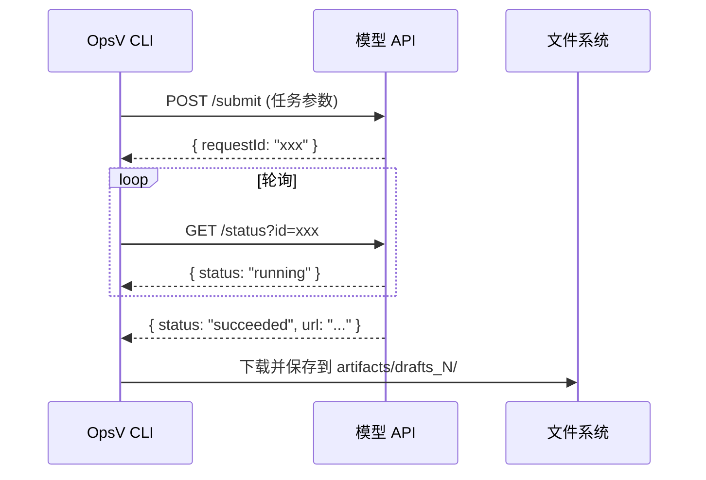

# OpsV 多模型 API 接口规范 (API Reference)

> 定义 OpsV 支持的各类生成模型的接口格式、数据类型及交互协议。

---

## 1. 核心交互模式

OpsV 采用 **"提交-轮询-下载"** 的异步模式：



---

## 2. 统一作业对象 (Internal Job Object)

所有模型的任务在 OpsV 内部使用统一的 Job 格式：

```typescript
interface Job {
  id: string;                          // 唯一标识（如 "shot_1_element_role_K"）
  type: "image_generation" | "video_generation";
  prompt_en: string;                   // 英文渲染提示词
  reference_images?: string[];         // 参考图本地路径数组
  output_path: string;                 // 输出绝对路径
  payload: {
    prompt: string;                    // 中文叙事上下文
    duration?: string;                 // 视频时长
    global_settings: {
      quality: "480p" | "720p" | "1080p" | "2K" | "4K";
    };
    schema_0_3?: {
      first_image?: string;            // 首帧参考图路径
      last_image?: string;             // 尾帧参考图路径
      reference_images?: string[];     // 角色特征参考图
    };
  };
}
```

---

## 3. ByteDance Seedance 1.5 Pro

### 3.1 提交接口 (Submit)

| 项目 | 值 |
|------|---|
| **Endpoint** | `https://ark.cn-beijing.volces.com/api/v3/video/submit` |
| **Method** | `POST` |
| **鉴权** | `Authorization: Bearer <VOLCENGINE_API_KEY>` |

**请求体**：
```json
{
  "model": "doubao-seedance-1-5-pro",
  "prompt": "Camera slowly orbits around the character...",
  "resolution": "720p",
  "aspect_ratio": "16:9",
  "duration": 5,
  "fps": 24,
  "image": "data:image/jpeg;base64,...",
  "last_image": "data:image/jpeg;base64,...",
  "sound": true
}
```

| 参数 | 类型 | 必填 | 说明 |
|------|------|------|------|
| `model` | string | ✅ | 固定值 `doubao-seedance-1-5-pro` |
| `prompt` | string | ✅ | 英文动态描述 |
| `resolution` | string | ✅ | `480p` / `720p` / `1080p` |
| `aspect_ratio` | string | - | `16:9` / `9:16` / `1:1` / `4:3` / `3:4` / `21:9` / `adaptive` |
| `duration` | integer | - | 整数秒 |
| `fps` | integer | - | 固定 `24` |
| `image` | string | - | 首帧 Base64（`data:image/jpeg;base64,...`） |
| `last_image` | string | - | 尾帧 Base64 |
| `sound` | boolean | - | 开启空间音频 |

### 3.2 状态查询 (Status)

| 项目 | 值 |
|------|---|
| **Endpoint** | `https://ark.cn-beijing.volces.com/api/v3/video/status?id=<requestId>` |
| **Method** | `GET` |

**响应体**：
```json
{
  "status": "succeeded",
  "video_url": "https://...",
  "error_message": ""
}
```

| status 值 | 含义 |
|-----------|------|
| `pending` | 排队中 |
| `running` | 生成中 |
| `succeeded` | 成功（包含 `video_url`） |
| `failed` | 失败（包含 `error_message`） |

---

## 4. SiliconFlow Wan 2.1

### 4.1 提交接口 (Submit)

| 项目 | 值 |
|------|---|
| **Endpoint** | `https://api.siliconflow.cn/v1/video/submit` |
| **Method** | `POST` |
| **鉴权** | `Authorization: Bearer <SILICONFLOW_API_KEY>` |

**请求体**：
```json
{
  "model": "wan-ai/Wan2.1-T2V-14B",
  "prompt": "A butterfly emerging from chrysalis...",
  "image_size": "1280x720"
}
```

### 4.2 状态查询 (Status)

| 项目 | 值 |
|------|---|
| **Endpoint** | `https://api.siliconflow.cn/v1/video/status` |
| **Method** | `POST` |

**请求体**：
```json
{
  "requestId": "..."
}
```

**响应体**：
```json
{
  "status": "Succeed",
  "results": {
    "videos": [
      { "url": "https://..." }
    ]
  }
}
```

| status 值 | 含义 |
|-----------|------|
| `InQueue` | 排队中 |
| `InProgress` | 生成中 |
| `Succeed` | 成功 |
| `Failed` | 失败 |

---

## 5. SeaDream 5.0 (图像生成)

### 5.1 提交接口 (Submit)

| 项目 | 值 |
|------|---|
| **Endpoint** | `https://api.volcengine.com/visual/image_generation/2024-08-01` |
| **Method** | `POST` |
| **鉴权** | `Authorization: Bearer <VOLCENGINE_API_KEY>` |

**请求体**：
```json
{
  "req_key": "high_definition_generation",
  "prompt": "A swallowtail butterfly with indigo wings...",
  "model_version": "seadream_5_0",
  "aspect_ratio": "16:9",
  "size": "2K",
  "width": 1024,
  "height": 1024
}
```

| 参数 | 类型 | 必填 | 说明 |
|------|------|------|------|
| `req_key` | string | ✅ | 固定值 `high_definition_generation` |
| `prompt` | string | ✅ | 生成提示词 |
| `model_version` | string | ✅ | 固定值 `seadream_5_0` |
| `aspect_ratio` | string | - | 官方预设画幅 |
| `size` | string | - | `2K` / `3K` / `4K` |
| `width` / `height` | integer | - | 不使用 `size` 时的自定义像素 |

### 5.2 响应格式

```json
{
  "data": {
    "binary_data_base64": ["..."],
    "image_urls": ["https://..."]
  }
}
```

> **注意**：SeaDream 是同步接口，无需轮询。

---

## 6. 异常处理协议 (Defensive Protocol)

所有 Provider 实现必须遵循以下三大防御性编程准则：

### 6.1 深度穿透解析 (Deep Penetrative Parsing)

API 返回体的结构可能不一致。必须兼容多种嵌套：

```typescript
// 防御性提取
const id = data?.id || data?.data?.id || data?.data?.[0]?.id;
const result = Array.isArray(data) ? data[0] : data;
```

### 6.2 强力证据式日志 (Evidential Logging)

禁止返回模糊的 `undefined`。所有异常必须记录原始 JSON：

```typescript
catch (error) {
  logger.error('API Error', {
    status: error.response?.status,
    data: JSON.stringify(error.response?.data),
    message: error.message,
  });
}
```

### 6.3 Axios 防空逻辑 (Axios Defensive Handling)

区分网络错误和业务错误：

```typescript
catch (error) {
  if (!error.response) {
    // 网络层错误（超时、DNS 失败等）
    logger.error(`Network error: ${error.code}`); // ETIMEDOUT, ECONNREFUSED
  } else {
    // 业务层错误（API 返回的错误码）
    logger.error(`API error ${error.response.status}: ${JSON.stringify(error.response.data)}`);
  }
}
```

---

## 7. 新模型接入指南

### Step 1：研究官方文档
获取目标模型的 API 端点、鉴权方式、请求/响应格式。

### Step 2：更新配置
在 `.env/api_config.yaml` 和 `templates/.env/api_config.yaml` 中添加模型配置。

### Step 3：实现 Provider
在 `src/executor/providers/` 中创建新的 Provider 类，实现提交和轮询逻辑。

### Step 4：注册 Dispatcher
在 `ImageModelDispatcher` 或 `VideoModelDispatcher` 中注册新 Provider 的映射。

### Step 5：更新文档
在本文档中添加新模型的接口描述。

### Step 6：编写测试
在 `test/` 目录下添加 Provider 的单元测试（使用 mock）。

> [!IMPORTANT]
> 任何新模型的接口参数必须严格依据官方 API 文档，严禁凭空想象或沿用通用参数名。

---

> *"接口即合约，文档即保险。"*
> *OpsV 0.4.1 | 最后更新: 2026-03-23*
