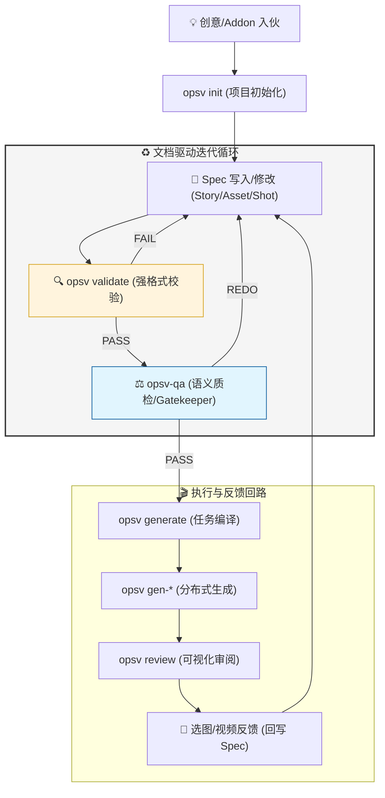

# OpsV 工作流程说明 (Workflow Guide)

> 从灵感到成片的五步循环，理解 Agent 协作与 CLI 命令的完整交互逻辑。

---

## 全景流程图 (文档生命周期中心化)



---

## 阶段一：项目初始化 (Init)

### 触发命令
```bash
opsv init [projectName]
```

### 发生了什么
1. **交互式选择** AI 助手（Gemini / OpenCode / Trae）
2. **复制模板**：
   - `.agent/` — Agent 角色定义 + Skills 技能手册
   - `.antigravity/` — 工作流和行为规则
   - `.env/` — API 配置模板
   - `GEMINI.md` / `AGENTS.md` — 按选择复制
3. **创建目录骨架**：
   - `videospec/stories/`、`videospec/elements/`、`videospec/scenes/`、`videospec/shots/`
   - `artifacts/`、`queue/`

### 产物
```
my-project/
├── .agent/skills/...
├── .env/api_config.yaml
├── videospec/
│   ├── stories/
│   ├── elements/
│   ├── scenes/
│   └── shots/
├── artifacts/
└── queue/
```

---

## 阶段二：文档定义与锚定 (Spec Anchoring)

### 协作逻辑
任何**创作类技能 (Creative Skills)** 或 **Addon**（如 Comic Pack）注入的创意，最终都必须落地为 `videospec/` 目录下的 Markdown 文档。

### 核心动作
1. **Spec 写入**：由创作插件或用户定义技能生成初稿（`project.md` 和 `story.md`）。
2. **强制校验 (Validation Dams)**：
   - 运行 **`opsv validate`**：确保 Markdown 语法和 YAML 头部符合 0.5 Zod 校验规则。
   - 运行 **`/opsv-qa act1`**：由 **Supervisor** 核查资产清单在逻辑上的一致性。

### 产物映射
- `videospec/project.md` — 全局参数、视觉风格一致性定义、资产花名册。
- `videospec/stories/story.md` — 叙事大纲，通过 `@id` 锚定实体。

### 同步反馈回路 (The Sync Loop) — 核心要求
**原则：正文是意志（Soul），YAML 是指令（CMD）。**
- **手动修改对齐**：当用户在 Markdown 正文（Body）中进行了手动修改后，Agent 必须具备感知能力，并触发 `UpdateField` 同步更新 YAML 中的 `visual_detailed` 字段。
- **对话一致性**：在每一轮 Review 对话结束后，Agent 生成的最终文档必须确保正文描述与 YAML 表头在语义上 100% 对齐。
- **质检卡点**：如果 `opsv-qa` 发现正文与 YAML 存在漂移，系统将拦截后续的生成任务。

---

## 阶段三：资产建模 (Asset Specification)

### 协作逻辑
**创作 Addon** 负责描写资产的视觉灵魂，而 **OpsV 规范技能** 负责将其固化为符合 0.5 标准的 `.md` 定义文件。
为 `project.md` 花名册中列出的每个实体创建独立的 `.md` 定义文件。

### 工作规则

1. **先读全局上下文**：必须读取 `project.md` 了解时代氛围和风格
2. **双通道参考图体系**：
   - `## Design References`（d-ref）：放入生成本实体时需要的输入参考图（灵感图、已有资产的 a-ref 用于变体生成）
   - `## Approved References`（a-ref）：放入定档后的正式参考图（经 `opsv review` 审批确认）
   - 两节均为空时 → 纯文生图，使用 `detailed_description`
   - 任一节非空时 → 使用 `brief_description` + 参考图
3. **YAML 存元数据，Markdown Body 存参考图链接** — 用户只维护一处

### 产物示例

```markdown
# videospec/elements/@role_butterfly.md
---
name: "@role_butterfly"
type: "character"
detailed_description: >
  一只翅膀如彩色玻璃般的凤蝶，翼展约15厘米。上翅为深邃的靛蓝色，
  边缘渐变为琥珀色，布满细密的金色鳞粉...
brief_description: "靛蓝渐变琥珀色的凤蝶，翅膀如彩色玻璃"
prompt_en: >
  A swallowtail butterfly with indigo-to-amber gradient wings,
  golden scale dust, glass-like transparency, macro photography,
  ethereal backlighting, 8k ultra detailed...
---

## Design References
- 链接灵感图、已有资产参考图等。

## Approved References
<!-- 选图定档后由系统或人工回写正式参考图链接 -->
```

### 变体链示例

```markdown
# videospec/elements/@role_butterfly_aged.md — 老化版蝴蝶
---
name: "@role_butterfly_aged"
type: "character"
brief_description: "翅膀褪色破损的老年凤蝶"
prompt_en: "An aged swallowtail butterfly, faded colors, torn wing edges..."
---

## Design References
- 链接作为该变体设计基础的定档图。
```

### 质检门禁 (Dams)
在进入生成环节前，必须通过以下关卡：
1. **`opsv validate`**：检测 Markdown 与 YAML 头部是否符合 Zod 校验。
2. **`/opsv-qa act2`**：扫描死链，核查所有引用的文件夹或资产是否物理存在。

---

## 阶段四：分镜编译与审阅 (Script → Generate → Review)

这是最核心的循环，包含 3 个子步骤。

### 4.1 分镜设计

**负责技能**：**Creative Addon (创作插件)** + **opsv-script-designer (规范技能)**

- 创作插件提供文学层面的镜头描述。
- 规范技能确保其输出为 `videospec/shots/Script.md` 格式。
- 输出 `videospec/shots/Script.md`（**纯 Markdown 正文，无 YAML 配置数组**）
- 每个 Shot 设计时长 **3-5 秒**，上限 **15 秒**
- 分镜中**严禁刻画角色外貌**，必须用 `@实体名` 引用

```markdown
# videospec/shots/Script.md

## Shot 1 (5s)
[@role_butterfly](../elements/@role_butterfly.md) 在 [@scene_cocoon] 中破茧而出。
极致微距，紧贴茧壳表面。
**Prompt:** Extreme macro shot of a butterfly emerging from chrysalis...

## Shot 2 (4s)
[@role_butterfly] 首次振翅，飞向 [@scene_spring_forest]。
广角仰拍。
**Prompt:** Low angle wide shot, butterfly's first wing spread...
```

### 4.2 图像生成

```bash
# 编译 Markdown 为 JSON 任务
opsv generate

# 执行图像渲染（默认同时调度 api_config.yaml 中所有启用的模型）
# 结果落盘至 artifacts/drafts_N/[引擎供应商]/ 下，形成“平行宇宙沙箱”
opsv gen-image

# 可选：预览模式（只生成关键镜头）
opsv generate --preview

# 可选：只生成指定镜头
opsv generate --shots 1,3,5
```

### 4.3 Web 页面可视化审阅

```bash
# 启动本地 Review 服务
opsv review
```

命令会在本地（如 `localhost:3456`）启动一个暗色主题的 Review 界面。
1. **网格选图**：在多个并发生成的渲染草图中，挑选最佳的 1-2 张。
2. **变体命名**：为选中的设计图指定命名（如 `morning`）。
3. **Approve 审批**：点击确认后，系统会自动将这些图片作为 `Approved References` 写入对应资产实体或分镜文件的正文中。

这取代了 v0.4 之前复杂且不直观的文本回写。

导演或美术总监在 Web 端选出最佳草图并确认后，可以直接交给后续流程。

### 质检门禁
- `/opsv-qa act2` — 扫描死链、检查超链接完整性
- `/opsv-qa act3` — 预警分镜中的特征泄漏

---

## 阶段五：动画编导 (Animation)

### 负责 Agent
**Animator** → 调用 `opsv-animator` 技能

### 核心任务
读取已审阅确认的 `Script.md`，提取纯动态控制指令，输出 `Shotlist.md`。

### 动静分离原则
- **不描述**穿什么衣服（已有参考图）
- **只描述**：镜头怎么动？角色怎么动？场景有什么动态变化？
- `motion_prompt_en` 必须**全英文**

### 产物示例 (v0.5)

```markdown
# videospec/shots/Shotlist.md

## Shot 1 (5s)
**Motion Prompt:** Extreme macro, chrysalis slowly cracks open, tiny legs push through...
- [参考首帧](@REF:shot_1_start)

## Shot 2 (4s)
**Motion Prompt:** Camera slowly pulls back to wide angle, butterfly spreads wings for the first time...
- [首帧继承](@FRAME:shot_1_last)
```

### 编译发布

```bash
# 将 Shotlist.md 编译为视频任务队列
opsv animate

# 执行视频生成（默认调度所有开启的视频模型如 Minimax、Seedance 等）
opsv gen-video
```

### 长镜头继承
当连续运动需要无缝衔接时，后续 Shot 的 `first_image` 设为 `@FRAME:<前一个shot_id>_last`，系统会自动截取前一视频的尾帧作为下一镜头的首帧。

### 质检门禁
`/opsv-qa final` — Payload 断言检查，确认全局风格后缀注入与参考图路径一致性。

---

## 质检体系总览

| Slash 命令 | 阶段 | 检查内容 |
|-----------|------|---------|
| `/opsv-qa act1` | 编剧后 | 资产花名册是否完整，无黑户无重复 |
| `/opsv-qa act2` | 选图后 | 死链扫描，参考图路径是否存在 |
| `/opsv-qa act3` | 分镜后 | 特征泄漏预警，防止容貌描写渗透分镜 |
| `/opsv-qa final` | 编译后 | Payload 断言，风格后缀注入 + 参考图对齐 |

所有质检由 **Supervisor Agent** 执行，输出红绿灯报告：
- 🟢 `PASS: 针脚严丝合缝`
- 🔴 `FAIL: 扫出 2 个未登记黑户：@xxx, @yyy`

---

## 循环迭代

以上五个阶段并非一次通过。实际场景中，导演会基于审阅结果反复迭代：

```
Script → Generate → gen-image → Review → (不满意) → 修改资产/分镜 → Generate → gen-image → Review → (OK)
                                                          ↑
                                                    opsv-apply 批量修改
```

`opsv-apply` 技能可以批量读取变更提案（`videospec/changes/*.md`）并自动执行资产更新。

---

> *"让创意如流水般流淌，让规范如堤坝般坚固。"*
> *OpsV 0.5.0 | 最后更新: 2026-04-09*
