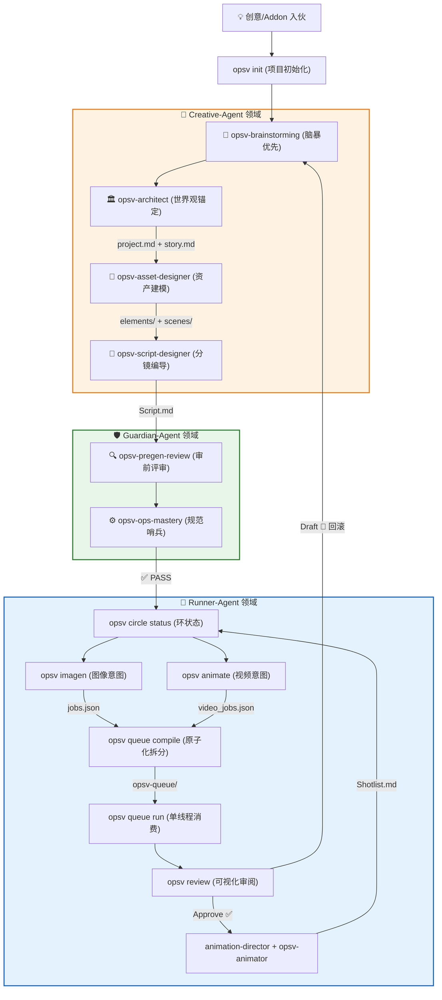

# OpsV 工作流程说明 (Workflow Guide)

> 从灵感到成片的三角色循环，理解 Agent 协作与 CLI 命令的完整交互逻辑。

---

## 全景流程图（三角色协作）



---

## 阶段一：项目初始化 (Init)

### 触发命令
```bash
opsv init [projectName]
```

### 发生了什么
1. **交互式选择** AI 助手（Gemini / Claude / OpenCode / Trae）或通过 CLI flag 非交互指定
2. **复制模板**：
   - `.agent/` — 3 个 Agent 角色定义 + 9 个 Skills 技能手册
   - `.env/` — API 配置模板
   - `AGENTS.md` — 按选择复制
3. **创建目录骨架**：
   - `videospec/stories/`、`videospec/elements/`、`videospec/scenes/`、`videospec/shots/`
   - `opsv-queue/`（运行时任务队列与资产落盘）
   - `.opsv/`（运行时状态）
4. **生成 `.gitignore`**：内建生成默认忽略规则，自动排除运行时目录

### 产物
```
my-project/
├── .agent/
│   ├── Creative-Agent.md
│   ├── Guardian-Agent.md
│   ├── Runner-Agent.md
│   └── skills/...
├── .env/api_config.yaml
├── .opsv/                  # v0.6.4 新增
├── opsv-queue/             # v0.6.4 统一队列目录
│   ├── circle_manifest.json
│   ├── zerocircle_1/
│   ├── firstcircle_1/
│   ├── secondcircle_1/
│   └── frames/
├── videospec/
│   ├── stories/
│   ├── elements/
│   ├── scenes/
│   └── shots/
└── .gitignore              # v0.6 内建生成
```

---

## 阶段二：脑暴与文档锚定 (Brainstorming & Spec Anchoring)

### 负责 Agent
**Creative-Agent** — 调用 `opsv-brainstorming` + `opsv-architect`

### 协作逻辑
任何**创作类技能（Creative Skills）**或 **Addon**（如 Comic Pack）注入的创意，最终都必须落地为 `videospec/` 目录下的 Markdown 文档。

### 核心动作
1. **脑暴优先**：严禁在未确认创意细节前直接落盘。通过三向提案（标准/先锋/意境）深挖导演意志。
2. **Spec 落盘**：由创作插件或用户定义技能生成初稿（`project.md`、`story.md`）。
3. **移交守卫**：文档初稿完成后，必须交由 **Guardian-Agent** 执行反射同步。

### 同步反馈回路 (The Sync Loop) — 核心要求
**原则：正文是意志（Soul），YAML 是指令（CMD）。**
- **反射同步**：当 Markdown 正文（Body）被修改后，Guardian-Agent 负责同步更新 YAML 中的 `visual_detailed` 字段。
- **对话一致性**：每次 Review 对话结束后，正文描述与 YAML 表头必须 100% 语义对齐。

---

## 阶段三：资产建模 (Asset Specification)

### 负责 Agent
**Creative-Agent** — 调用 `opsv-asset-designer`

### 工作规则

1. **先读全局上下文**：必须读取 `project.md` 了解时代氛围和风格。
2. **双通道参考图体系**：
   - `## Design References`（d-ref）：放入生成本实体时需要的输入参考图
   - `## Approved References`（a-ref）：放入定档后的正式参考图（经 `opsv review` 审批确认）
   - 两节均为空时 → 纯文生图，使用 `visual_detailed`
   - 任一节非空时 → 使用 `visual_brief` + 参考图
3. **YAML 存元数据，Markdown Body 存参考图链接** — 用户只维护一份。

### 质检门禁 (Dams)
由 **Guardian-Agent** 执行：
1. **`opsv validate`**：检查 Markdown 的 YAML 头部是否符合 Zod 校验。
2. **`opsv-pregen-review`**：审前评审，确保视觉颗粒度达标后方可进入生成。

---

## 阶段四：编译 → 投递 → 消费 → 审阅 (Circle Queue Pipeline)

这是 v0.6.4 的核心架构。工作按 **Circle（环）** 分层执行，每环内资产互相无依赖，可并行生成。

### 4.1 Circle 状态检查

```bash
opsv circle status          # 实时刷新各 Circle 完成状态（文档变更后必须重跑）
opsv circle manifest        # 将拓扑快照写入 opsv-queue/circle_manifest.json
```

**设计原理**：Circle 不是静态配置，而是文档依赖关系的**动态投影**。`opsv circle status` 每次运行都会重新扫描 `videospec/` 下所有 `.md` 文件，从 frontmatter 的 `refs` 字段重建依赖图，拓扑排序得到分层，并读取 `## Approved References` 区域统计批准状态。

Circle 序号由 `DependencyGraph` 的拓扑排序自动计算：
- 无依赖资产 → ZeroCircle
- 依赖 ZeroCircle 资产 → FirstCircle
- 依赖 FirstCircle 资产 → SecondCircle
- 依此类推

**状态图标与 Agent 决策**：

| 图标 | 状态 | 含义 | Agent 动作 |
|------|------|------|------------|
| ⭕ | 未开始 | 该 Circle 无任何 approved 资产 | 禁止启动下游；执行本 Circle `imagen`/`animate` |
| ⏳ | 进行中 | 部分资产已批准 | 继续完成未批准资产；仍禁止启动下游 |
| ✅ | 已完成 | 全部资产已批准 | 执行 `manifest` 固化快照，允许晋升下一 Circle |

**触发刷新的事件**（以下任一事件发生后必须重新执行 `opsv circle status`）：

| 事件 | 原因 |
|------|------|
| 新增/修改/删除 `.md` 文件 | `refs` 依赖关系可能改变，资产可能重新分层 |
| Review Approve/Draft | 批准状态变化，可能解锁/阻断下游 Circle |
| 迭代重生成 | 旧结果失效，迭代计数增加 |
| 手动编辑 `## Approved References` | 引用路径可能变化 |

**晋升检查流程**（进入下一 Circle 前）：

```bash
opsv circle status          # 检查当前 Circle 是否全部 approved（✅）
opsv circle manifest        # 固化状态快照到 circle_manifest.json
opsv animate                # 基于 approved 资产生成下游任务（自动推断末端 Circle）
```

### 4.2 分镜设计

**负责 Agent**：**Creative-Agent** — 调用 `opsv-script-designer`

- 输出 `videospec/shots/Script.md`（纯 Markdown 正文，无 YAML 配置数组）
- 每个 Shot 设计时长 **3-5 秒**，上限 **15 秒**
- 分镜中**严禁刻画角色外貌**，必须用 `@实体名` 引用
- **严禁硬编码** `target_model` 等执行流配置

### 4.3 意图编译 (imagen / animate / comfy)

```bash
# 图像资产（通常在 ZeroCircle / FirstCircle）
opsv imagen [targets...]
# 产出: opsv-queue/<circle>/imagen_jobs.json

# 视频资产（默认自动推断依赖图末端环）
opsv animate [--circle auto]
# 产出: opsv-queue/<endcircle>/video_jobs.json

# ComfyUI 工作流（可处于任意 Circle）
opsv comfy compile <workflow.json> --provider <comfyui_local|runninghub> --circle <name>
# 产出: opsv-queue/<circle>/<provider>/queue_{N}/
```

- `opsv imagen` / `opsv animate` / `opsv comfy` 只生成对应媒介类型的 **任务列表（jobs.json）**，**不入队**
- 集成 DependencyGraph 严格模式，依赖未 approved 自动阻塞

### 4.4 原子化投递 (Queue Compile)

```bash
# 将意图编译为特定 API 的原子任务卡片
opsv queue compile <jobs.json> --model <provider.model|alias> [--circle <name>]
```

- 在 `opsv-queue/<circle>/<provider>/` 下创建新 batch：`queue_{max+1}/`
- 每次 `compile` 都新建 batch，不会追加到已有 batch
- 任务写入 `queue.json` manifest

### 4.5 单线程消费 (Queue Run)

```bash
# 启动 QueueWatcher，逐一消费任务
opsv queue run <provider> [--circle <name>]
```

- `QueueWatcher` 读取 `queue.json` manifest，取第一个 `status: pending` 任务
- 更新 manifest 状态为 `processing`
- 读取同目录下的 `{taskId}.json` 获取完整任务意图
- 调用对应 Provider 的 `processTask()`
- Provider 调用远程 API，下载结果到 `opsv-queue/<circle>/<provider>/queue_{N}/{jobId}_{seq}.png`
- 更新 `queue.json` 状态为 `completed` 或 `failed`

### 4.6 Web 页面可视化审阅

```bash
# 启动本地 Review 服务（默认端口 3456）
opsv review
```

1. **网格选图**：在多个并发生成的渲染草图中，挑选最佳的 1-2 张
2. **变体命名**：为选中的设计图指定命名（如 `morning`）
3. **Approve / Draft 双态**：
   - **Approve**：系统自动将图片引用作为 `Approved References` 回写到源 Markdown 文档（图片保持在原队列目录中），更新 `status: approved`，自动 `git commit`
   - **Draft**：记录修改意见，回滚到 Creative-Agent 重新迭代

---

## 阶段五：动画编导 (Animation)

### 负责 Agent
**Runner-Agent** — 调用 `opsv-animator` + `animation-director`

### 核心任务
读取已审阅确认的 `Script.md`，提取纯动态控制指令，输出 `Shotlist.md`。

### 动静分离原则
- **不描述**：穿什么衣服（已有参考图）
- **只描述**：镜头怎么动？角色怎么动？场景有什么动态变化？
- `motion_prompt_en` 必须**全英文**
- **机位优先**：强制指定摄影机运动，避免 AI 视频沦为 PPT

### 编译发布

```bash
# 从 Shotlist.md 编译为视频意图
opsv animate

# 编译为特定视频 API 任务
opsv queue compile opsv-queue/<circle>/video_jobs.json --model volcengine.seedance-2.0

# 执行视频生成
opsv queue run seedance
```

### 长镜头继承
当连续运动需要无缝衔接时，后续 Shot 的 `first_image` 设为 `@FRAME:<前一个shot_id>_last`，系统会自动截取前一视频的尾帧作为下一镜头的首帧。

---

## 循环迭代

以上五个阶段并非一次通过。实际场景中，导演会基于审阅结果反复迭代：

```
Creative-Agent → Guardian-Agent → Runner-Agent → Review → (不满意) → 回滚 → Creative-Agent
```

### Review 后的 Circle 状态刷新

每次 Review（Approve 或 Draft）后，**必须**执行 `opsv circle status` 重新计算状态：

- **Approve 后**：检查该 Circle 是否全部 approved（✅）。若是，执行 `opsv circle manifest` 固化快照，然后允许启动下一 Circle 的生成管线。
- **Draft 后**：确认该 Circle 退回 ⏳ 或 ⭕ 状态，**必须阻断**下游 Circle 的启动，直到问题资产重新 approved。

### 文档变更后的重新分层

当导演修改 `videospec/` 下任何 `.md` 文件（尤其是修改 `refs` 字段）后：

```bash
opsv validate              # 1. 校验文档语法
opsv circle status         # 2. 刷新 Circle 状态（依赖关系可能已改变）
opsv deps                  # 3. 查看新的拓扑排序
```

三角色协作确保每一轮迭代中，创意、规范、执行三个维度各司其职、互不越界。

---

> *"让创意如流水般流淌，让规范如堤坝般坚固。"*
> *OpsV 0.6.4 | 最后更新 2026-04-22*
