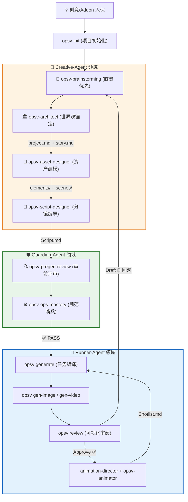

# OpsV 工作流程说明 (Workflow Guide)

> 从灵感到成片的三角色循环，理解 Agent 协作与 CLI 命令的完整交互逻辑。

---

## 全景流程图 (三角色协作)



---

## 阶段一：项目初始化 (Init)

### 触发命令
```bash
opsv init [projectName]
```

### 发生了什么
1. **交互式选择** AI 助手（Gemini / OpenCode / Trae）
2. **复制模板**：
   - `.agent/` — 3 个 Agent 角色定义 + 9 个 Skills 技能手册
   - `.antigravity/` — 工作流和行为规则
   - `.env/` — API 配置模板
   - `GEMINI.md` / `AGENTS.md` — 按选择复制
3. **创建目录骨架**：
   - `videospec/stories/`、`videospec/elements/`、`videospec/scenes/`、`videospec/shots/`
   - `artifacts/`、`queue/`

### 产物
```
my-project/
├── .agent/
│   ├── Creative-Agent.md
│   ├── Guardian-Agent.md
│   ├── Runner-Agent.md
│   └── skills/...
├── .env/api_config.yaml
├── videospec/
│   ├── stories/
│   ├── elements/
│   ├── scenes/
│   └── shots/
├── artifacts/
└── queue/
```

---

## 阶段二：脑暴与文档锚定 (Brainstorming & Spec Anchoring)

### 负责 Agent
**Creative-Agent** → 调用 `opsv-brainstorming` + `opsv-architect`

### 协作逻辑
任何**创作类技能 (Creative Skills)** 或 **Addon**（如 Comic Pack）注入的创意，最终都必须落地为 `videospec/` 目录下的 Markdown 文档。

### 核心动作
1. **脑暴优先**：严禁在未确认创意细节前直接落盘。通过三向提案（标准/先锋/意境）深挖导演意志。
2. **Spec 落盘**：由创作插件或用户定义技能生成初稿（`project.md` 和 `story.md`）。
3. **移交守卫**：文档初稿完成后，必须交由 **Guardian-Agent** 执行反射同步。

### 同步反馈回路 (The Sync Loop) — 核心要求
**原则：正文是意志（Soul），YAML 是指令（CMD）。**
- **反射同步**：当 Markdown 正文（Body）被修改后，Guardian-Agent 负责同步更新 YAML 中的 `visual_detailed` 字段。
- **对话一致性**：每轮 Review 对话结束后，正文描述与 YAML 表头必须 100% 语义对齐。
- **质检卡点**：如果 `opsv validate` 发现正文与 YAML 存在漂移，系统将拦截后续生成任务。

---

## 阶段三：资产建模 (Asset Specification)

### 负责 Agent
**Creative-Agent** → 调用 `opsv-asset-designer`

### 工作规则

1. **先读全局上下文**：必须读取 `project.md` 了解时代氛围和风格
2. **双通道参考图体系**：
   - `## Design References`（d-ref）：放入生成本实体时需要的输入参考图
   - `## Approved References`（a-ref）：放入定档后的正式参考图（经 `opsv review` 审批确认）
   - 两节均为空时 → 纯文生图，使用 `visual_detailed`
   - 任一节非空时 → 使用 `visual_brief` + 参考图
3. **YAML 存元数据，Markdown Body 存参考图链接** — 用户只维护一处

### 质检门禁 (Dams)
由 **Guardian-Agent** 执行：
1. **`opsv validate`**：检测 Markdown 与 YAML 头部是否符合 Zod 校验。
2. **`opsv-pregen-review`**：审前评审，确保视觉颗粒度达标后方可进入生成。

---

## 阶段四：分镜编译与审阅 (Script → Generate → Review)

这是最核心的循环，包含 3 个子步骤。

### 4.1 分镜设计

**负责 Agent**：**Creative-Agent** → 调用 `opsv-script-designer`

- 输出 `videospec/shots/Script.md`（**纯 Markdown 正文，无 YAML 配置数组**）
- 每个 Shot 设计时长 **3-5 秒**，上限 **15 秒**
- 分镜中**严禁刻画角色外貌**，必须用 `@实体名` 引用
- **严禁硬编码** `target_model` 等执行流配置（v0.5.14+）

### 4.2 图像生成

**负责 Agent**：**Runner-Agent**

```bash
# 编译 Markdown 为 JSON 任务
opsv generate

# 执行图像渲染（默认同时调度 api_config.yaml 中所有启用的模型）
# 结果落盘至 artifacts/drafts_N/[引擎供应商]/ 下，形成"平行宇宙沙箱"
opsv gen-image

# 可选：预览模式（只生成关键镜头）
opsv generate --preview

# 可选：只生成指定镜头
opsv generate --shots 1,3,5
```

### 4.3 Web 页面可视化审阅

```bash
# 启动本地 Review 服务
opsv review
```

命令会在本地（如 `localhost:3456`）启动一个暗色主题的 Review 界面。
1. **网格选图**：在多个并发生成的渲染草图中，挑选最佳的 1-2 张。
2. **变体命名**：为选中的设计图指定命名（如 `morning`）。
3. **Approve / Draft 双态**：
   - **Approve**：系统自动将图片作为 `Approved References` 回写，更新 `status: approved`
   - **Draft**：记录修改意见，回滚至 Creative-Agent 重新迭代

### 质检门禁
由 **Guardian-Agent** 在各阶段执行 `opsv-pregen-review` 和 `opsv-ops-mastery` 中的校验逻辑。

---

## 阶段五：动画编导 (Animation)

### 负责 Agent
**Runner-Agent** → 调用 `opsv-animator` + `animation-director`

### 核心任务
读取已审阅确认的 `Script.md`，提取纯动态控制指令，输出 `Shotlist.md`。

### 动静分离原则
- **不描述**穿什么衣服（已有参考图）
- **只描述**：镜头怎么动？角色怎么动？场景有什么动态变化？
- `motion_prompt_en` 必须**全英文**
- **机位优先**：强制指定摄影机运动，避免 AI 视频沦为 PPT

### 编译发布

```bash
# 将 Shotlist.md 编译为视频任务队列
opsv animate

# 执行视频生成（默认调度所有开启的视频模型如 Seedance 1.5 Pro、Seedance 2.0 Fast 等）
opsv gen-video
```

### 长镜头继承
当连续运动需要无缝衔接时，后续 Shot 的 `first_image` 设为 `@FRAME:<前一个shot_id>_last`，系统会自动截取前一视频的尾帧作为下一镜头的首帧。

---

## 循环迭代

以上五个阶段并非一次通过。实际场景中，导演会基于审阅结果反复迭代：

```
Creative-Agent → Guardian-Agent → Runner-Agent → Review → (不满意) → 回滚至 Creative-Agent
```

三角色协作确保每一轮迭代中，创意、规范、执行三个维度各司其职、互不越界。

---

> *"让创意如流水般流淌，让规范如堤坝般坚固。"*
> *OpsV 0.5.19 | 最后更新: 2026-04-17*
