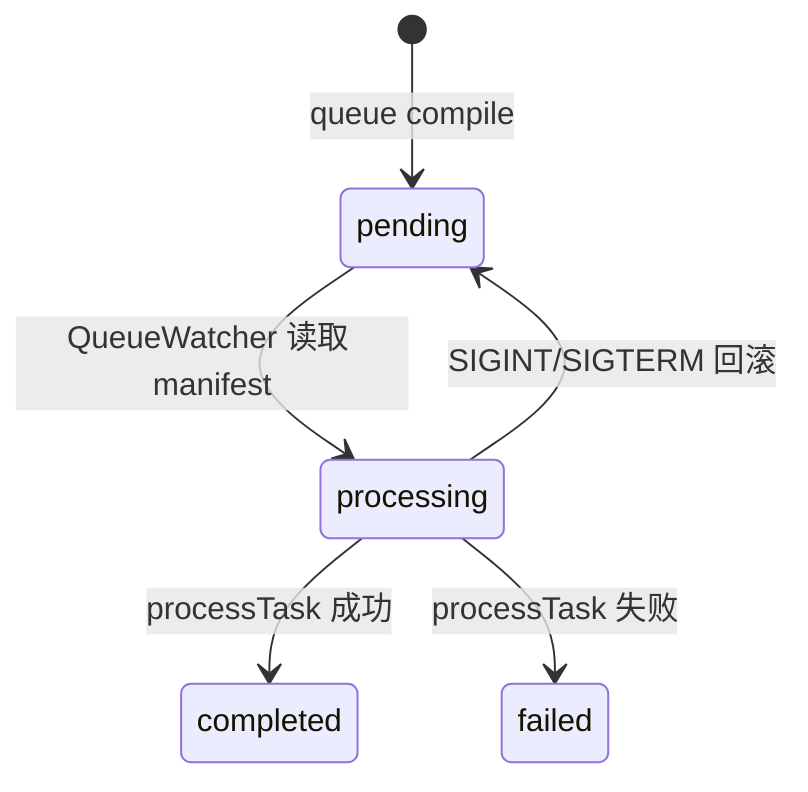

# OpsV Provider 接口规范（v0.6.4）

> 本文件记录所有图像/视频生成 Provider 必须遵守的接口契约与 Circle Queue 接入规范。

---

## 1. 架构演进

**v0.6.4 Circle Queue 架构**：

```
之前（v0.6.0 已废弃）Spooler Queue 模式：
  opsv generate → jobs.json (纯意图)
  opsv queue compile → .opsv-queue/pending/{provider}/UUID.json (原子载荷)
  opsv queue run {provider} → QueueWatcher → provider.processTask(task)
  目录: .opsv-queue/inbox/working/done

现在（v0.6.4 现行）Circle Queue 模式：
  opsv imagen / animate / comfy → opsv-queue/<circle>/jobs.json (意图)
  opsv queue compile <jobs.json> --model <provider.model|alias> --circle <name>
    → opsv-queue/<circle>/<provider>/queue_{N}/ (batch 目录)
    → opsv-queue/<circle>/<provider>/queue_{N}/{taskId}.json (原子任务)
  opsv queue run --model <provider.model|alias> --circle <name>
    → QueueWatcher → provider.processTask(task)
  优势: Circle 分层依赖、全局唯一序号、批次隔离
```

---

## 2. 接口定义

### 2.1 Provider 通用接口

所有 Provider 必须实现 `processTask` 方法，由 QueueWatcher 逐一调用。

```typescript
// Provider 接口契约（v0.6.4）
interface SpoolerProvider {
    /** 处理从队列中取出的单个原子任务 */
    processTask(task: SpoolerTask): Promise<any>;
}

// SpoolerTask 结构
interface SpoolerTask {
    uuid: string;          // 任务唯一 ID
    payload: any;          // 编译器产出的 API 特定载荷
    metadata: {
        provider: string;  // 来源 Provider 标识
        createdAt: string; // 创建时间
    };
}
```

### 2.2 QueueWatcher 调用协议

```typescript
// QueueWatcher 逐一消费，无分支
const task = await queue.dequeue();
const result = await provider.processTask(task);
await queue.markCompleted(task.uuid, result);
// 失败时:
await queue.markFailed(task.uuid, error);
```

---

## 3. 现有 Provider 一览

### 图像 Provider

| Provider 类 | 文件 | 供应商 | 队列 Provider 名 |
|-------------|------|--------|------------------|
| `SeaDreamProvider` | providers/SeaDreamProvider.ts | 火山引擎 | `volcengine` |
| `SiliconFlowProvider` | providers/SiliconFlowProvider.ts | SiliconFlow | `siliconflow` |
| `MinimaxImageProvider` | providers/MinimaxImageProvider.ts | MiniMax | `minimax` |

### 视频 Provider

| Provider 类 | 文件 | 供应商 | 队列 Provider 名 |
|-------------|------|--------|------------------|
| `VolcengineProvider` | providers/VolcengineProvider.ts | 火山引擎（SeaDream / Seedance） | `volcengine` |
| `SiliconFlowProvider` | providers/SiliconFlowProvider.ts | SiliconFlow | `siliconflow` |
| `MinimaxVideoProvider` | providers/MinimaxVideoProvider.ts | MiniMax | `minimax` |

### ComfyUI Provider

| Provider 类 | 文件 | 说明 | 队列 Provider 名 |
|-------------|------|------|------------------|
| `ComfyUILocalProvider` | providers/ComfyUILocalProvider.ts | 本地 ComfyUI 实例 | `comfyui_local` |
| `RunningHubProvider` | providers/RunningHubProvider.ts | RunningHub 云端 | `runninghub` |

---

## 4. 新增 Provider 强制规范

### 4.1 三条铁律（继承自防御性 API 协议）

1. **深度穿透解析**：不假设响应体结构唯一。兼容 `data.id`、`data.data.id` 多种变体，使用防御性代码。
2. **强力证据式日志**：任何非 2xx 或格式异常必须 `JSON.stringify(rawResponse)` 记录完整载荷，禁止模糊 `undefined` 输出。
3. **Axios 防空逻辑**：必须区分 `error.response`（API 业务错误）和 `error.code`（如 `ETIMEDOUT`，网络中断）。

### 4.2 接入步骤清单 (v0.6.4 流程)

```
需要实现：
  ✅ 创建 Provider 类文件: src/executor/providers/YourProvider.ts
  ✅ 实现 processTask(task: SpoolerTask): Promise<any>
  
  ✅ processTask 内部实现:
     1. 从 task.payload 读取参数
     2. POST 提交生成请求（按官方 API 格式）
     3. 轮询直到完成（建议间隔 3-5 秒，超时抛异常）
     4. 下载图片/视频 Buffer，写入目标路径
     5. 返回结果对象

需要注册：
  ✅ 在 src/commands/queue.ts 的 run 命令中添加 provider 分支
  ✅ 在 api_config.yaml 中配置 provider 和 type 字段

禁止：
  ❌ 创建新的 Dispatcher（Dispatcher 模式已废弃）
  ❌ 在 Provider 内部使用 instanceof 检测其他 Provider
  ❌ 在 Provider 内部假设载荷结构（从 task.payload 读取）
```

### 4.3 超时与退避约定

```typescript
// Provider 内部应自行管理超时
const TIMEOUT_MS = 5 * 60 * 1000; // 5 分钟
const deadline = Date.now() + TIMEOUT_MS;
let waitTime = 5000;  // 初始轮询间隔 5 秒

while (Date.now() < deadline) {
    const status = await pollStatus(requestId);
    if (status === 'completed') break;
    await sleep(waitTime);
    waitTime = Math.min(waitTime * 2, 30000);  // 指数退避，上限 30 秒
}

if (Date.now() >= deadline) {
    throw new Error(`生成超时 (${TIMEOUT_MS / 1000}s): ${task.uuid}`);
}
```

**指数退避策略：** 视频生成 Provider（Seedance、SiliconFlow）采用指数退避轮询，降低长视频生成时的 API 压力。
- 第 1 次：5 秒
- 第 2 次：10 秒
- 第 3 次：20 秒
- 第 4 次及以后：30 秒（封顶）

---

## 5. Circle Queue 状态机

### 5.1 目录结构

```
opsv-queue/
├── <circle>_<iteration>/          # 如: zerocircle_1, secondcircle_1
│   ├── imagen_jobs.json           # 图像任务列表
│   ├── video_jobs.json            # 视频任务列表
│   ├── comfy_jobs.json            # ComfyUI 任务列表
│   ├── <provider>/                # Provider 目录
│   │   ├── queue_1/               # 批次 1
│   │   │   ├── queue.json         # manifest（任务状态表）
│   │   │   ├── {taskId}.json      # 原子任务文件
│   │   │   └── {jobId}_{seq}.png  # 全局序号产出
│   │   └── queue_2/               # 批次 2（每次 compile +1）
│   └── ...
└── frames/                        # 帧提取（@FRAME 引用解析落盘）
```

### 5.2 状态流转



### 5.3 状态管理保证

v0.6.4 采用 **中心 Manifest 状态管理** 取代旧版的文件系统目录状态机：

- **单线程消费**：`QueueWatcher` 同一时刻只处理一个任务，天然避免竞争
- **状态回滚**：`SIGINT/SIGTERM` 时，若当前任务处于 `processing`，自动将其回写为 `pending`
- **Manifest 原子写**：`saveManifest()` 通过 `fs.writeFile` 完整覆写 `queue.json`，确保状态一致性
- **任务意图隔离**：每个任务的完整 payload 存储在独立的 `{taskId}.json` 中，manifest 仅保存状态元数据

> 旧版 v0.6.0 的 `.opsv-queue/inbox/working/done` 目录 + `fs.rename` 原子提取机制已在 v0.6.4 中废弃。

### 5.4 资产命名规则

- 全局唯一序号：`{jobId}_{seq}.{ext}`（如 `shot_01_1.png`, `hero_3.png`）
- `SequenceCounter` 递归扫描整个 `opsv-queue/` 树来确定下一个序号

---

## 6. 编译器协作

### StandardAPICompiler

- 将 `Job` 对象序列化为原子任务文件
- 注入 provider 元数据
- 适用于所有原生 HTTP API（Volcengine, Minimax, SiliconFlow）
- Provider 参数防御：
  | Provider | 防御逻辑 |
  |----------|----------|
  | `siliconflow` | 强制尺寸对齐到推荐列表，清理冗余字段 |
  | `volcengine` | `2K` → `1920x1080`，默认 `1280x720`；Seedance 2.0 自动构建 `content` 数组 |
  | `minimax` | 默认启用 `prompt_optimizer: true` |

### ComfyUITaskCompiler

- 加载 Addon 中的 JSON 工作流模板
- 通过节点标题约定（`input-prompt`, `input-image1`）进行参数注入
- 适用于 ComfyUI 类执行环境（Local / RunningHub）
- RunningHub 模式下自动拦截本地文件路径并上传为 URL

---

> *「物理状态机替代内存调度，文件即证据，目录即状态。」*
> *OpsV v0.6.4 | 更新时间: 2026-04-22*
