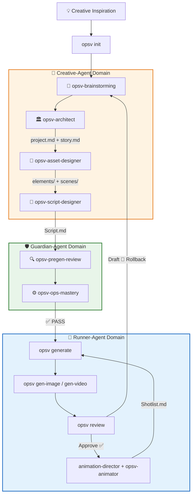

# OpsV Workflow Guide

> From inspiration to final video in a three-role cycle, understanding Agent collaboration and CLI interaction.

---

## Overall Flowchart (Three-Role Collaboration)



---

## Phase 1: Project Initialization (Init)

### Trigger Command
```bash
opsv init [projectName]
```

### What Happens
1. **Interactive selection** of AI assistant (Gemini / OpenCode / Trae).
2. **Template copying**:
   - `.agent/` — 3 Agent role definitions + 9 Skills.
   - `.antigravity/` — Workflow templates.
   - `.env/` — API config templates.
3. **Directory skeleton creation**:
   - `videospec/stories/`, `videospec/elements/`, `videospec/scenes/`, `videospec/shots/`
   - `artifacts/`, `queue/`

---

## Phase 2: Brainstorming & Concept Anchoring

### Responsible Agent
**Creative-Agent** → Invokes `opsv-brainstorming` + `opsv-architect`

### Core Actions
1. **Brainstorming First**: Never settle specs before confirming creative details. Use the Trinity Choice (Standard / Avant-garde / Zen) to deep-dive into the director's vision.
2. **Spec Settlement**: Generate initial drafts (`project.md` and `story.md`) via creative plugins or user-driven skills.
3. **Handoff to Guardian**: Once drafts are complete, they must be handed to **Guardian-Agent** for reflective sync.

### The Sync Loop — Core Requirement
**Principle: Body is the Will (Soul), YAML is the Command (CMD).**
- **Reflective Sync**: When the Markdown body is modified, Guardian-Agent updates the YAML `visual_detailed` field.
- **Consistency**: After each review dialogue, body description and YAML header must be 100% semantically aligned.
- **Gatekeeper**: If `opsv validate` detects drift between body and YAML, downstream generation is blocked.

---

## Phase 3: Asset Design

### Responsible Agent
**Creative-Agent** → Invokes `opsv-asset-designer`

### Design Principles
1. **Context Awareness**: Must read `project.md` to align with the overall atmosphere.
2. **Dual-Channel References**:
   - `Design References` (d-ref): Images used when creating the asset itself.
   - `Approved References` (a-ref): Approved images for downstream references.
3. **Quality Gates**: Executed by **Guardian-Agent** via `opsv validate` and `opsv-pregen-review`.

---

## Phase 4: Storyboard Compilation & Review

### 4.1 Scripting
- **Responsible Agent**: **Creative-Agent** → `opsv-script-designer`.
- **Pure Markdown body format**, no YAML configuration array needed.
- No character descriptions; use `@entity` tags only.
- **No hardcoded** `target_model` or execution flow configs (v0.5.14+).

### 4.2 Image Generation
**Responsible Agent**: **Runner-Agent**
```bash
opsv generate        # Compile Spec -> JSON jobs
opsv gen-image       # Render images (Parallel Universe Sandbox)
```

### 4.3 Web UI Review
```bash
opsv review          # Start local Review server
```
Opens a dark-themed Web UI (e.g., `localhost:3456`) for visual selection:
- **Approve**: Auto write-back to `## Approved References`, update `status: approved`
- **Draft**: Record modification notes, rollback to Creative-Agent for iteration

---

## Phase 5: Animation & Video

### Responsible Agent
**Runner-Agent** → Invokes `opsv-animator` + `animation-director`

### Core Task
Read confirmed `Script.md` and extract pure motion instructions into `Shotlist.md`.

### Statics-Motion Separation
- Only describe camera movement and subject action; appearances are handled by references.
- **Camera First**: Force camera movement descriptions to prevent AI "slideshow" videos.
- `motion_prompt_en` must be **English only**.

### Video Generation
```bash
opsv animate         # Compile Shotlist -> Video jobs
opsv gen-video       # Render videos (Seedance 1.5 Pro, 2.0 Fast, etc.)
```

### Long-Take Inheritance
Via `@FRAME:shot_N_last` — the system auto-extracts the last frame of the previous video as the first frame of the next shot.

---

## Iterative Cycle

The five phases are not a one-pass process. Directors iterate based on review results:

```
Creative-Agent → Guardian-Agent → Runner-Agent → Review → (Unsatisfied) → Rollback to Creative-Agent
```

The three-role collaboration ensures creativity, specification, and execution each stay in their lane.

---

> *"Let creativity flow like water, let specification be the dam."*
> *OpsV 0.5.19 | Latest Update: 2026-04-17*
