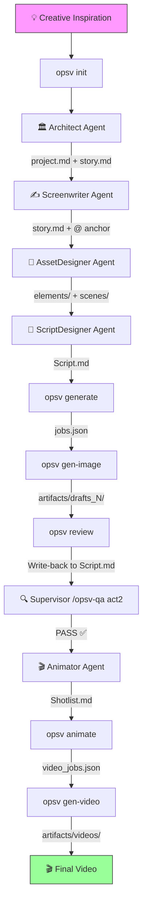

# OpsV Workflow Guide

> From inspiration to final video in a five-step cycle, understanding Agent collaboration and CLI interaction.

---

## Overall Flowchart



---

## Phase 1: Project Initialization (Init)

### Trigger Command
```bash
opsv init [projectName]
```

### What Happens
1. **Interactive selection** of AI assistant (Gemini / OpenCode / Trae).
2. **Template copying**:
   - `.agent/` — Agent role definitions + Skills.
   - `.antigravity/` — Workflow templates.
   - `.env/` — API config templates.
3. **Directory skeleton creation**:
   - `videospec/stories/`, `videospec/elements/`, `videospec/scenes/`, `videospec/shots/`
   - `artifacts/`, `queue/`

---

## Phase 2: Concept Anchoring

### Responsible Agent
**Architect** → Invokes `opsv-architect` skill.

### Two-Phase Workflow

#### Phase 1: Ideation
- Input: A lyric, a melody description, or a vague concept.
- Output: **3 distinct story proposals**, each including title, core plot (3-5 sentences), visual style, and asset list.

#### Phase 2: World-Building
- Director selects a proposal, generating two core files:
  - `videospec/project.md` — Global parameters & asset manifest.
  - `videospec/stories/story.md` — Narrative outline with `@` entity anchors.

---

## Phase 3: Asset Design

### Responsible Agent
**AssetDesigner** → Invokes `opsv-asset-designer` skill.

### Design Principles (OPSV-ASSET-0.4)

1. **Context Awareness**: Must read `project.md` to align with the overall atmosphere.
2. **Dual-Channel References**:
   - `Design References` (d-ref): Images used when creating the asset itself (img2img).
   - `Approved References` (a-ref): Approved images provided as references when other entities cite this asset.
3. **Variant Chains**: Linking an existing asset's a-ref to a new asset's d-ref to generate variants (e.g., aging a character).

---

## Phase 4: Storyboard Compilation & Review

### 4.1 Scripting
- **Responsible Agent**: **ScriptDesigner**.
- Reads `story.md` and converts narrative into structured shot language in `Script.md`.
- No character descriptions; use `@entity` tags only.

### 4.2 Image Generation
```bash
opsv generate        # Compile Spec -> JSON jobs
opsv gen-image       # Render images (Parallel Universe Sandbox)
```

### 4.3 Review
```bash
opsv review          # Update Markdown with latest generation results
```
Director selects the best drafts in the IDE preview and annotates confirmation.

---

## Phase 5: Animation & Video

### 5.1 Animation Scripting
- **Responsible Agent**: **Animator**.
- Reads confirmed `Script.md` and extracts pure motion instructions into `Shotlist.md`.
- **Statics-Motion Separation**: Only describe camera movement and subject action; appearances are handled by references.

### 5.2 Video Generation
```bash
opsv animate         # Compile Shotlist -> Video jobs
opsv gen-video       # Render videos across enabled models
```

---

## Quality Assurance (QA) System

| Slash Command | Stage | Checks |
|-----------|------|---------|
| `/opsv-qa act1` | After Scripting | Asset manifest completeness |
| `/opsv-qa act2` | After Review | Dead links and reference paths |
| `/opsv-qa act3` | After Storyboarding | Concept bleeding (appearance leaks) |
| `/opsv-qa final` | Before Render | Payload assertions & style injection |

---

> *"Let creativity flow like water, let specification be the dam."*
> *OpsV 0.4.3 | Latest Update: 2026-03-28*
