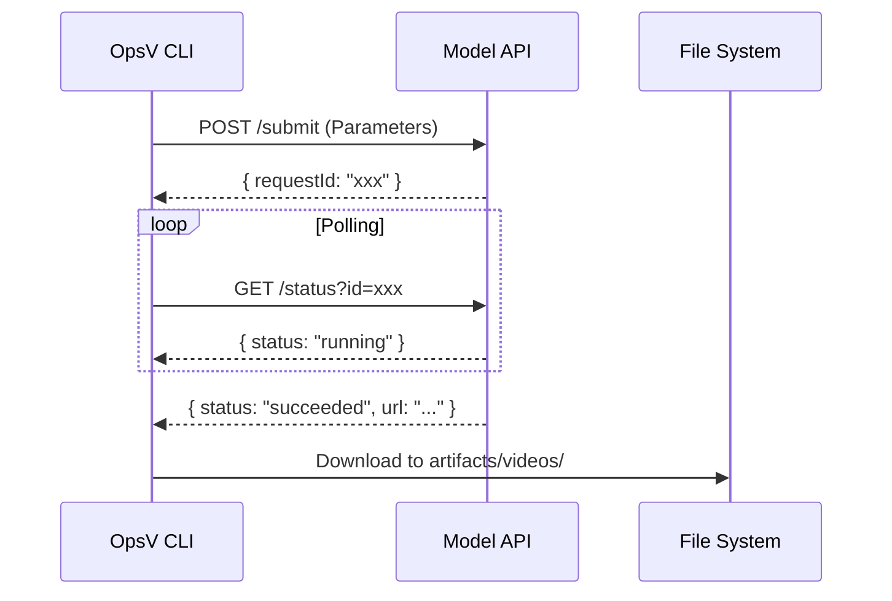

# OpsV Multi-Model API Reference

> Defines the interface formats, data types, and interaction protocols for all generative models supported by OpsV.

---

## 1. Core Interaction Pattern

OpsV uses an asynchronous **"Submit-Poll-Download"** pattern:



---

## 2. Unified Job Object (Internal)

All model tasks are transformed into a unified Job format internally:

```typescript
interface Job {
  id: string;                          // Unique ID (e.g., "shot_1")
  type: "image_generation" | "video_generation";
  prompt_en: string;                   // English render prompt
  reference_images?: string[];         // Local paths to reference images
  output_path: string;                 // Destination path
  payload: {
    duration?: number;
    quality: string;
    aspect_ratio: string;
    first_image?: string;
    last_image?: string;
  };
}
```

---

## 3. ByteDance Seedance 1.5 Pro

### 3.1 Submission (Submit)
- **Endpoint**: `https://ark.cn-beijing.volces.com/api/v3/video/submit`
- **Method**: `POST`
- **Auth**: `Authorization: Bearer <VOLCENGINE_API_KEY>`

**Key Parameters**:
- `model`: `doubao-seedance-1-5-pro`
- `prompt`: English motion description.
- `resolution`: `480p`, `720p`, `1080p`.
- `image`: Base64 of the first frame.
- `last_image`: Base64 of the last frame.

---

## 4. SiliconFlow Wan 2.1

### 4.1 Submission (Submit)
- **Endpoint**: `https://api.siliconflow.cn/v1/video/submit`
- **Auth**: `Authorization: Bearer <SILICONFLOW_API_KEY>`

**Key Parameters**:
- `model`: `wan-ai/Wan2.1-T2V-14B`
- `prompt`: Narrative/Motion description.

---

## 5. SeaDream 5.0 (Image Gen)

### 5.1 Submission (Submit)
- **Endpoint**: `https://api.volcengine.com/visual/image_generation/2024-08-01`
- **Auth**: `Authorization: Bearer <VOLCENGINE_API_KEY>`

**Key Parameters**:
- `req_key`: `high_definition_generation`
- `model_version`: `seadream_5_0`
- `aspect_ratio`: `16:9`, `1:1`, etc.

---

## 6. Defensive Protocols

All Providers must implement these three defensive coding standards:

1. **Deep Penetrative Parsing**: Handle inconsistent nested response bodies (`data.id`, `data.data.id`, etc.).
2. **Evidential Logging**: Never return `undefined`; always log the raw JSON payload on error.
3. **Axios Defensive Handling**: Distinguish between network-level errors (ETIMEDOUT) and business-level API errors.

---

> *"The Interface is the Contract; Documentation is the Insurance."*
> *OpsV 0.4.3 | Latest Update: 2026-03-29*
