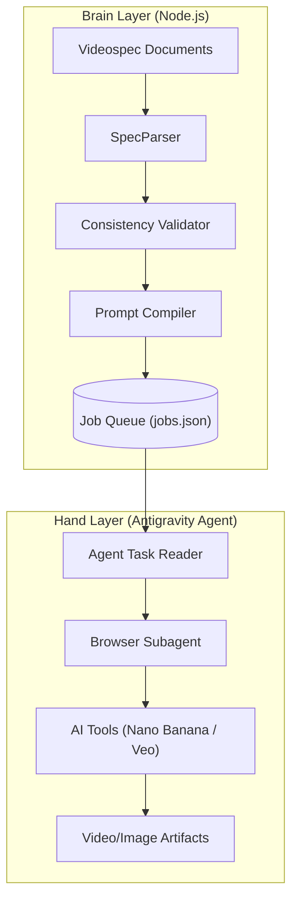

# 技术架构说明书 (Technical Architecture)

## 1. 架构概览 (System Overview)
本系统采用**“大脑-手臂”双层分离架构 (Brain-Hand Architecture)**。
- **大脑层 (Brain Layer)**：由 Node.js/TypeScript 实现的本地逻辑，负责“思考”——解析文档、校验逻辑、生成任务。这一层是确定性的（Deterministic）。
- **手臂层 (Hand Layer)**：由 Antigravity Agent 实现的自动化操作，负责“执行”——操作浏览器、点击按钮、处理异常。这一层是适应性的（Adaptive）。



## 2. 模块详解 (Component Design)

### 2.1 核心解析器 (`src/core`)
- **SpecParser**: 基于 `unified` 生态解析 Markdown AST，提取 Frontmatter 元数据与剧本正文。
- **AssetManager**: 维护一个内存中的资产注册表（Asset Registry），确保所有 Prompt 引用的 `character_id` 都有对应的 `reference_image_path`。

### 2.2 提示词编译器 (`src/automation`)
- **PromptSchema**: 定义了适配 Nano Banana Pro 要求的 JSON 结构（Subject, Environment, Lighting, Camera）。
- **JobBuilder**: 遍历分镜（Shot），将剧本描述（Script）转化为结构化 Prompt，并注入资产路径。

### 2.3 执行协议 (Execution Protocol)
- **Jobs.json 规范**：
  ```json
  [
    {
      "id": "shot_001",
      "type": "image_generation",
      "target_tool": "nano_banana_pro",
      "payload": {
        "prompt": "{...}",
        "neg_prompt": "..."
      },
      "assets": ["/abs/path/to/char_a.png"],
      "output": "/abs/path/to/artifacts/shot_001.png"
    }
  ]
  ```

## 3. 关键技术决策 (Key Decisions)
1.  **为什么选择 Node.js?**
    OpenSpec 本质上是处理 JSON/YAML/Markdown 的数据流。JavaScript 生态拥有最强的 JSON 处理能力（如 Zod 验证）和最丰富的 AST 解析库（Remark/Rehype）。

2.  **为什么不使用 Selenium/Puppeteer?**
    现代 AI 网页工具（如 Google AI Studio）往往有复杂的反爬虫机制和动态 DOM ID。Antigravity 的 `Browser Subagent` 基于视觉感知和语义理解，比基于选择器的传统爬虫更加鲁棒，能处理 UI 变化。
